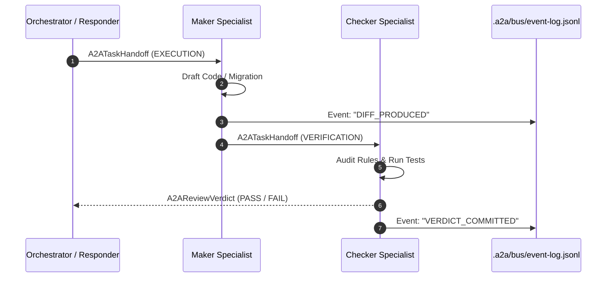

# Agent-to-Agent (A2A) Protocol Specification

**Standard Identifier:** A2A-v1.0  
**Location:** `.a2a/SPEC.md`  
**Governing Standard:** Mandatory Compliance with the 9 Core Agent Setup Pillars  
**Classification:** Canonical Communication & Task Handoff Protocol  
**Last Updated:** 2026-09-11

---

## 1. Scope & Objective

The **Agent-to-Agent (A2A)** Protocol standardizes how autonomous agents, background daemons, and specialist worker subagents communicate, delegate tasks, synchronize state, and perform mutual verification within the Arch-System monorepo.

A2A solves the critical failure modes of ad-hoc multi-agent swarms:

- Eliminates non-deterministic conversational drift between agents.
- Enforces strict typed JSON schema payloads over conversational chatter.
- Mandates Maker-Checker dual-mind verification before code state is mutated.
- Provides cryptographic traceability and append-only event logging on the A2A bus.

---

## 2. The 9 Core Agent Setup Pillars (Mandatory Foundation)

Every agent card registered under `.a2a/registry/` and every interaction on the A2A bus MUST strictly satisfy these 9 pillars:

```
┌─────────────────────────────────────────────────────────────────────────────┐
│                       THE 9 CORE AGENT SETUP PILLARS                        │
├────┬───────────────────────────────┬────────────────────────────────────────┤
│ #  │ Pillar                        │ Purpose & Architectural Guard          │
├────┼───────────────────────────────┼────────────────────────────────────────┤
│ 1  │ Identity & Dispatch Routing   │ Unique kebab-case name, mode & routing │
│ 2  │ Model & Runtime Envelope      │ Model tier, temperature (0.0-0.2), turn│
│ 3  │ Capability & Tool Sandboxing  │ Strict whitelist/blacklist, least priv │
│ 4  │ Scope & Path Isolation        │ Explicit include globs & blacklist     │
│ 5  │ Stateful Lifecycle Runbook    │ Ingest -> Audit -> Mutate -> Verify    │
│ 6  │ Hard Negative Constraints     │ Absolute NEVER rules (no chat, no mock)│
│ 7  │ Input Contract (Payload)      │ Strictly typed JSON task payload       │
│ 8  │ Output Contract (Schema)      │ Machine-parseable JSON exit verdict    │
│ 9  │ Error & Recovery Protocol     │ Standard exit codes & rollback commands│
└────┴───────────────────────────────┴────────────────────────────────────────┘
```

---

## 3. A2A Interaction Topologies

### 1. Maker-Checker Verification Pattern (Dual-Mind)

For any architectural, database, or security-sensitive change:

1. **Maker Subagent** (e.g. `databaseArchitect`): Produces the proposed modification diff in isolation.
2. **Checker Subagent** (e.g. `securityAndQualityGate`): Receives the handoff payload, executes independent static analysis (`QualityGate`), and issues an immutable `review-verdict`.
3. If the verdict is `FAIL` or `WARNING` below the 90-point quality threshold, the change is rejected or passed to `ReflectionEngine` for auto-remediation.



### 2. Fan-Out / Fan-In Parallel Swarm

When a broad repository audit is initiated:

1. Orchestrator broadcasts individual domain-targeted `A2ATaskHandoff` payloads to all 10 specialists in parallel.
2. Concurrency is governed by `pLimit` (default 3 concurrent processes).
3. Each specialist executes within its isolated path scope and returns an `A2AReviewVerdict`.
4. Orchestrator aggregates verdicts into an `AgentSwarmReport`.

---

## 4. Message Envelopes & Schema Specifications

All A2A interactions are validated against JSON schemas in [.a2a/schemas/](file:///home/timothy/Projects/Arch-System/.a2a/schemas/):

### 1. Task Handoff Envelope

```json
{
  "$schema": "http://json-schema.org/draft-07/schema#",
  "type": "object",
  "required": [
    "taskId",
    "senderAgent",
    "recipientAgent",
    "phase",
    "targetFiles",
    "inputPayload",
    "timestamp"
  ],
  "properties": {
    "taskId": { "type": "string" },
    "senderAgent": { "type": "string" },
    "recipientAgent": { "type": "string" },
    "phase": {
      "type": "string",
      "enum": ["INGESTION", "DISCOVERY", "EXECUTION", "VERIFICATION", "COMPLETION"]
    },
    "targetFiles": {
      "type": "array",
      "items": { "type": "string" }
    },
    "inputPayload": { "type": "object" },
    "constraints": {
      "type": "array",
      "items": { "type": "string" }
    },
    "timestamp": { "type": "string", "format": "date-time" }
  }
}
```

### 2. Review Verdict Envelope

```json
{
  "$schema": "http://json-schema.org/draft-07/schema#",
  "type": "object",
  "required": ["taskId", "auditorAgent", "verdict", "score", "violations", "timestamp"],
  "properties": {
    "taskId": { "type": "string" },
    "auditorAgent": { "type": "string" },
    "verdict": { "type": "string", "enum": ["PASS", "WARNING", "FAIL"] },
    "score": { "type": "number", "minimum": 0, "maximum": 100 },
    "violations": {
      "type": "array",
      "items": {
        "type": "object",
        "required": ["ruleId", "filePath", "description", "severity"],
        "properties": {
          "ruleId": { "type": "string" },
          "filePath": { "type": "string" },
          "lineNumber": { "type": "integer" },
          "description": { "type": "string" },
          "severity": { "type": "string", "enum": ["CRITICAL", "WARNING", "INFO"] }
        }
      }
    },
    "recommendations": {
      "type": "array",
      "items": { "type": "string" }
    },
    "timestamp": { "type": "string", "format": "date-time" }
  }
}
```

---

## 5. Event Bus & Audit Ledger (`.a2a/bus/`)

All cross-agent events are appended as immutable, single-line JSON records to [.a2a/bus/event-log.jsonl](file:///home/timothy/Projects/Arch-System/.a2a/bus/event-log.jsonl):

```json
{
  "eventId": "evt_1789123000",
  "timestamp": "2026-09-11T19:15:00.000Z",
  "eventType": "TASK_DISPATCHED",
  "sender": "responder-orchestrator",
  "recipient": "database-architect",
  "taskId": "task-vector-alignment",
  "payloadSummary": "Align vector search function dimensions to 768"
}
```

### Bus Guarantees

- **Append-Only**: Existing records must never be modified or deleted.
- **Traceability**: Every mutation in the codebase must correlate with a task ID on the bus.
- **Local Persistence**: Zero cloud latency or external dependency; runs locally on standard POSIX filesystem primitives.
