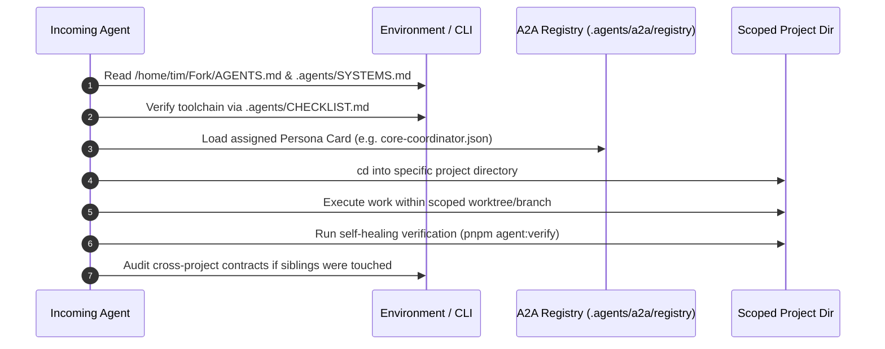

# Autonomous Agent Onboarding Playbook

> **Canonical Document:** `.agents/ONBOARDING.md`  
> **Target Audience:** All AI Agents (Antigravity, Cursor, Codex, OpenCode, Claude Code, Subagents)  
> **Governing SSoT:** `/home/tim/Fork/AGENTS.md` and `.agents/SYSTEMS.md`

---

## 1. Mandatory Reading & Orientation Order

Before executing any file modification, command, or subagent dispatch:

1. **[Fork/AGENTS.md](file:///home/tim/Fork/AGENTS.md)** — Core workspace architecture, independent project boundaries, and Vercel project mappings.
2. **[.agents/SYSTEMS.md](file:///home/tim/Fork/.agents/SYSTEMS.md)** — Canonical systems specification (Harness, RAG, DAG Pipelines, A2A Protocol, Authority Matrix).
3. **[.agents/GUIDE.md](file:///home/tim/Fork/.agents/GUIDE.md)** — Operational commands, conventions, debugging, and environment gotchas.
4. **Target Project Guide:**
   - For portal work: **[Arch-System/.agents/GUIDE.md](file:///home/tim/Fork/Arch-System/.agents/GUIDE.md)** and **[Arch-System/AGENTS.md](file:///home/tim/Fork/Arch-System/AGENTS.md)**.
   - For sibling services: Project-specific `README.md` and `package.json`.

---

## 2. Hard Workspace Invariants (Absolute Rules)

1. **NO ROOT RUNNER:**
   - `/home/tim/Fork` has **NO root `package.json`**.
   - **NEVER** run `pnpm install`, `pnpm build`, or `npm test` from `/home/tim/Fork`.
   - Always run commands scoped inside `Arch-System/`, `arch-system-nest-proxy/`, `redis/`, or `n8n-vercel/`.
2. **ZERO EXTERNAL API COSTS:**
   - All LLM inference must use Google Gemini / Antigravity models (`GEMINI_API_KEY`).
   - All embeddings must run locally via `transformers.js` (`all-MiniLM-L6-v2`) in Ruflo.
   - All web scraping must use the LAN Firecrawl service on `http://192.168.0.215:3002`.
3. **ZERO-INTERRUPTION SELF-HEALING:**
   - Before reporting completion to the user, run native verification (`pnpm agent:verify` or `npm test`).
   - If tests fail, autonomously inspect the trace, repair the source, and re-verify until passing without asking the user for help.
4. **MAKER-CHECKER SEPARATION:**
   - Any sensitive architecture, database, or security change must be submitted to the Maker-Checker review gate on the A2A bus before merging.

---

## 3. Session Bootstrapping Sequence

---

## 4. Persona Selection & A2A Handoffs

Select the matching agent persona card from `.agents/a2a/registry/`:

- **Master Coordination:** `core-coordinator.json`
- **Cross-Project Auditing:** `federation-auditor.json`
- **Deployments & Preflight:** `deployment-sentinel.json`
- **Code & Migration Review:** `maker-checker-gate.json`
- **Contract Synchronization:** `contract-sync-agent.json`

For deep monorepo work inside `Arch-System`, refer to the 40+ specialized domain personas under `Arch-System/.agents/a2a/registry/`.
