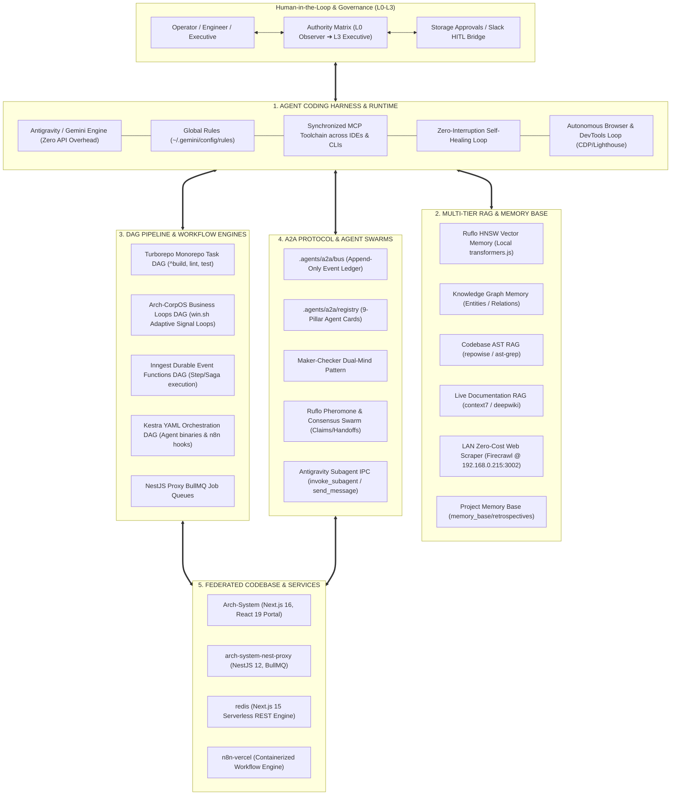
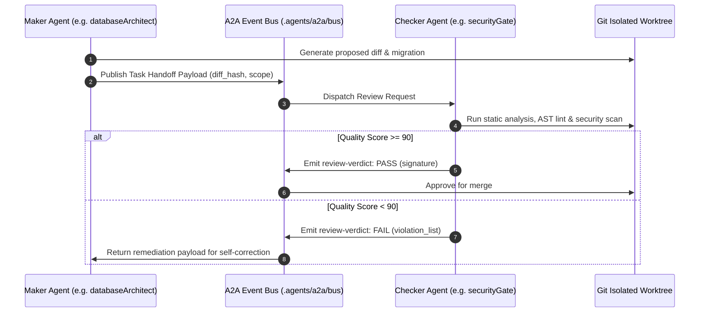

# Federated Systems Architecture & Agent Infrastructure Specification

> **Canonical Document:** `.agents/SYSTEMS.md`  
> **Classification:** Systems Engineering, Agentic Toolchain, Swarm Topology & Memory SSoT  
> **Target Scope:** Workspace (`/home/tim/Fork`), Portal Monorepo (`Arch-System`), and Federated Services  
> **Last Updated:** 2026-10-02

---

## Executive Summary & System Topology

This document details the complete autonomous software engineering and multi-agent operations infrastructure powering the Plantcor mining operations workspace. The ecosystem integrates **Agent Runtimes (Harness)**, **Multi-Tier RAG & Memory**, **DAG Workflow Pipelines**, **Agent-to-Agent (A2A) Protocols**, and **Governance Matrices** into a self-healing, zero-cost operational framework.



---

## 1. Agent Coding Harness & Runtime Layer

The harness governs how AI models receive instructions, discover tools, execute code, and verify modifications without human friction.

### 1.1 Multi-IDE / Runtime Synchronized Configuration

The environment unifies agent configuration across all runtimes on the developer machine via identical MCP configurations and behavioral rules:

- **Google Antigravity CLI & Subagents:** `~/.gemini/antigravity-cli/mcp/mcp.json`
- **Cursor IDE:** `~/.cursor/mcp.json`
- **Orca IDE / Codex Runtime:** `~/.config/orca/codex-runtime-home/home/config.toml`
- **Codex CLI:** `~/.codex/config.toml`
- **OpenCode:** `~/.config/opencode/opencode.json`
- **VS Code:** `~/.config/Code/User/mcp.json`
- **Global Shell & Daemon Environment:** `~/.config/mcp-env`

### 1.2 Global Behavioral Directives (`~/.gemini/config/rules/`)

1. **Zero-Interruption Self-Healing (`global-self-healing.md`):**
   - Mandate: Run native project verification (`pnpm agent:verify`, `npm run build`, `turbo run test`) before speaking.
   - Non-zero exit code: Strictly prohibited from halting to ask the user for assistance. Autonomous self-correction is executed iteratively until tests pass.
2. **Autonomous Browser & DevTools Loop (`autonomous-browser-devtools-loop.md`):**
   - Implements closed-loop loop-engineering (`cobusgreyling/loop-engineering`):
     $$\text{Sense (Perception)} \longrightarrow \text{Plan (Diagnosis)} \longrightarrow \text{Act (Remediation)} \longrightarrow \text{Evaluate (Critic)} \longrightarrow \text{Self-Correct}$$
   - Uses CDP, Puppeteer, Lighthouse CLI, and Playwright (`@axe-core/playwright`) to verify Speed Index, contrast ratios ($\ge 4.5:1$), touch targets ($\ge 44\times 44\text{px}$), and ARIA compliance.
3. **Global Toolchain Mandate (`global-toolchain.md`):**
   - Prioritizes AST structural search (`ast-grep` / `sg`) over regex `grep`.
   - Uses syntax-aware diffing (`difftastic` / `difft`) over standard `git diff`.
   - Packages codebase context for LLM multi-agents via `repomix`.
   - Formats configuration using `jq` and `yq`.
4. **Ruflo & Gemini Orchestration (`ruflo-gemini-orchestration.md`):**
   - Multi-agent coordination and vector memory ledger powered by `@claude-flow/cli`.
   - Zero third-party API costs: Models are executed via Google Gemini / Antigravity; embeddings run locally via `transformers.js`.
5. **Local Firecrawl Scraping (`local-firecrawl-scraping.md`):**
   - Zero-cost, unauthenticated LAN scraping on `192.168.0.215:3002`. Strict boundary: Agent research only, never injected into application code.

---

## 2. Multi-Tier Retrieval-Augmented Generation (RAG) & Memory Systems

The memory infrastructure spans from instant AST lookup to cross-session vector search and persistent knowledge graphs.

| Tier                   | Component               | Technology                                                        | Storage / Endpoint                    | Scope & Function                                                                                                        |
| :--------------------- | :---------------------- | :---------------------------------------------------------------- | :------------------------------------ | :---------------------------------------------------------------------------------------------------------------------- |
| **Vector RAG**         | Ruflo HNSW Memory       | `@claude-flow/cli`, `transformers.js` (`Xenova/all-MiniLM-L6-v2`) | Local SQLite / Vector DB              | Semantics-based search over architectural patterns, solutions, and subagent trajectory logs. Zero cloud embedding cost. |
| **Graph RAG**          | Knowledge Graph Memory  | `@modelcontextprotocol/server-memory`                             | Stdio MCP                             | Entity-relation knowledge graph (`create_entities`, `create_relations`, `search_nodes`) mapping cross-project concepts. |
| **Codebase AST RAG**   | Repowise & ast-grep     | `repowise mcp`, `sg`                                              | `Arch-System` source tree             | Deep AST code intelligence, symbol definitions, circular dependency detection, and change risk scoring.                 |
| **Library Docs RAG**   | Context7                | `@upstash/context7-mcp`                                           | Upstash Remote / Local MCP            | Real-time version-pinned documentation and type definitions for libraries (React 19, Next.js 16, BullMQ, Tailwind).     |
| **Ephemeral Skill & Context** | Skills & Context Registry | `skills-mcp` (`dist/index.js`)                                 | Stdio MCP                             | Anti-bloat on-demand skill, context, and persona registry (`acquire_skill`, `acquire_context`, `list_available_personas`). Leased and returned per subtask. |
| **Public Git RAG**     | DeepWiki                | `https://mcp.deepwiki.com/mcp`                                    | Remote MCP                            | Instant access to public GitHub repository documentation and open-source implementation guides.                         |
| **Web & LAN RAG**      | Firecrawl Local Scraper | `firecrawl-mcp` wrapper                                           | `http://192.168.0.215:3002/v2/scrape` | High-speed markdown conversion of public documentation, RFCs, and API references without cloud tokens or rate limits.   |
| **Retrospective SSoT** | Project Memory Base     | JSON / Markdown Files                                             | `.agents/memory_base/`                | Cross-session retrospective logbook, incident post-mortems, and architectural lessons learned.                          |


---

## 3. Directed Acyclic Graph (DAG) Workflows & Pipeline Orchestration

The platform executes complex, asynchronous operations through specialized DAG engines rather than ad-hoc scripts.

```mermaid
graph TD
    subgraph TurboBuildDAG ["Turborepo Build DAG"]
        T_Types["@repo/typescript-config"] --> T_Contract["@repo/contract"]
        T_Contract --> T_DB["@repo/database"]
        T_DB --> T_Redis["@repo/redis"]
        T_Redis --> T_Portal["apps/portal (Next.js 16 Build)"]
    end

    subgraph CorpOSBusinessDAG ["Arch-CorpOS Business Loop DAG (win.sh)"]
        C_Signal["1. Telemetry / Git Signal"] --> C_Brief["2. Synthesize Markdown Brief"]
        C_Brief --> C_Worktree["3. Isolated Worktree Mutation"]
        C_Worktree --> C_Gate["4. Quality Gate & Jest Assertions"]
        C_Gate --> C_Outcome["5. Generate Impact Outcome Card"]
        C_Outcome --> C_Journal["6. Commit to journal.jsonl"]
    end

    subgraph InngestEventDAG ["Inngest Durable Function DAG"]
        I_Trigger["shift.closed Event"] --> I_Step1["step.run('compile_scada')"]
        I_Step1 --> I_Step2["step.run('verify_smr_hours')"]
        I_Step2 --> I_Step3["step.run('generate_audit_hash')"]
        I_Step3 --> I_Step4["step.run('notify_dispatch_supervisors')"]
    end
```



### 3.1 Turborepo Monorepo Pipeline DAG

- Configured in `Arch-System/turbo.json`.
- Enforces topological execution order (`^build`, `^lint`, `^test`).
- Hashes source inputs, environment variables, and downstream package dependencies for deterministic caching.

### 3.2 Arch-CorpOS Autonomous Business Loops DAG (`.agents/corpos/`)

- Combines concepts from `win.sh`, `SafetyMP/CorpOS`, and `ai-company`.
- Replaces rigid cron jobs with signal-driven, adaptive loops.
- **Workflow:**
  1. **Signal Intake:** Monitors SCADA anomaly thresholds, git commit triggers, or test regressions.
  2. **Brief First:** Compiles `briefs/<tick_id>.md` detailing scope, necessity, and safety budget.
  3. **Worktree Isolation:** Executes code modifications within a temporary Git worktree (`storage/worktrees/`).
  4. **Quality Gate:** Automated AST lint, type-check, and regression tests.
  5. **Outcome Evaluation:** Produces `outcomes/<tick_id>.md` measuring metric deltas.
  6. **Append-Only Journal:** Logs execution metadata to `journal.jsonl`.
  7. **Adaptive Scheduling:** Dynamically expands or contracts the next tick interval based on system health.

### 3.3 Inngest Durable Execution DAG (`packages/utils/inngest`)

- Used for high-reliability background business workflows (e.g., atomic shift closeouts, SCADA aggregation).
- Provides durable step functions, automatic exponential retries, compensation steps (Saga pattern), and state memoization across serverless invocations.

### 3.4 Kestra & BullMQ Queue Pipelines

- **Kestra Orchestration (`kestra/`):** Declarative YAML DAGs connecting n8n webhooks with local machine agent binaries (`/home/tim/.local/bin/agent-*`).
- **NestJS BullMQ Dispatcher (`arch-system-nest-proxy`):** Redis-backed job queues for distributed background tasks, telemetry stream ingestion, and rate-limited webhooks.

---

## 4. Agent-to-Agent (A2A) Protocol & Swarm Coordination

Autonomous agent collaboration operates under the **A2A-v1.0** protocol, eliminating non-deterministic conversational drift and unverified code mutations.

### 4.1 The 9 Core Agent Setup Pillars

Every agent registered under `.agents/a2a/registry/` must define:

1. **Identity & Dispatch Routing:** Unique kebab-case name, primary role, and task intake filters.
2. **Model & Runtime Envelope:** Target model tier, deterministic temperature ($0.0 - 0.2$), and max turn limits.
3. **Capability & Tool Sandboxing:** Whitelist of allowed MCP tools and blacklisted dangerous operations.
4. **Scope & Path Isolation:** Globs restricting which directories the agent may read and write.
5. **Stateful Lifecycle Runbook:** Explicit stage progression: `Ingest ➔ Audit ➔ Mutate ➔ Verify`.
6. **Hard Negative Constraints:** Non-negotiable boundaries (e.g., "NEVER mock production telemetry", "NEVER use external paid LLMs").
7. **Input Contract:** Strictly validated JSON task payload schema.
8. **Output Contract:** Machine-parseable JSON exit verdict schema.
9. **Error & Recovery Protocol:** Standardized exit codes and atomic rollback commands.

### 4.2 Swarm Topologies

#### 1. Maker-Checker Dual-Mind Pattern

Before any sensitive database, security, or architecture change is merged:



#### 2. Ruflo Consensus & Distributed Claims

- Coordinated via `@claude-flow/cli`.
- Uses distributed claims (`claims_claim`, `claims_release`, `claims_handoff`) to guarantee that only one agent modifies a given package, route, or schema at a time.
- Employs swarm consensus (`hive-mind_consensus`) to resolve architectural conflicts between specialist subagents.

### 4.3 Canonical Workspace Agent Registry (`.agents/a2a/registry/`)

The workspace registers 9 canonical agents in [.agents/a2a/registry/index.json](file:///home/tim/Fork/.agents/a2a/registry/index.json) strictly following the 9 pillars:

| Agent Card                                                                                            | Role & Mode         | Authority Tier | Runtime Model      | Core Purpose                                                                                     |
| :---------------------------------------------------------------------------------------------------- | :------------------ | :------------- | :----------------- | :----------------------------------------------------------------------------------------------- |
| **[`core-coordinator.json`](file:///home/tim/Fork/.agents/a2a/registry/core-coordinator.json)**       | Master Coordinator  | L1 Advisor     | `gemini-2.5-flash (low)` | Multi-agent task decomposition, RISEN prompt construction, and context budget allocation.        |
| **[`federation-auditor.json`](file:///home/tim/Fork/.agents/a2a/registry/federation-auditor.json)**   | Parity Auditor      | L0 Observer    | `gemini-2.5-flash (low)` | Inspects Git HEAD vs Vercel deployments and verifies cross-service CSP allowlists.               |
| **[`deployment-sentinel.json`](file:///home/tim/Fork/.agents/a2a/registry/deployment-sentinel.json)** | Deployment Sentinel | L3 Executive   | `gemini-2.5-flash (low)` | Preflight checks, scoped Vercel dispatch, post-deploy health probes, and automated rollback.     |
| **[`maker-checker-gate.json`](file:///home/tim/Fork/.agents/a2a/registry/maker-checker-gate.json)**   | Dual-Mind Checker   | L1 Advisor     | `gemini-2.5-flash (low)` | Independent AST review, anti-mock invariant verification, and static quality scoring ($\ge 90$). |
| **[`contract-sync-agent.json`](file:///home/tim/Fork/.agents/a2a/registry/contract-sync-agent.json)** | Contract Specialist | L2 Operator    | `gemini-2.5-flash (low)` | Synchronizes Zod contracts and DTOs between `@repo/contract`, proxy, and redis engine.           |
| **[`memory-curator.json`](file:///home/tim/Fork/.agents/a2a/registry/memory-curator.json)**           | Memory Curator      | L1 Advisor     | `gemini-2.5-flash (low)` | Retrospective indexing, Knowledge Graph sync, and local Ruflo HNSW vector curation.              |
| **[`rag-librarian.json`](file:///home/tim/Fork/.agents/a2a/registry/rag-librarian.json)**             | RAG Librarian       | L0 Observer    | `gemini-2.5-flash (low)` | Context7, DeepWiki, and local unauthenticated Firecrawl scraper (`192.168.0.215:3002`).          |
| **[`hitl-bridge.json`](file:///home/tim/Fork/.agents/a2a/registry/hitl-bridge.json)**                 | HITL Sentinel       | L3 Executive   | `gemini-2.5-flash (low)` | Authority matrix gatekeeper, approval cards in `storage/approvals/`, and Slack review channel.   |
| **[`swarm-consensus.json`](file:///home/tim/Fork/.agents/a2a/registry/swarm-consensus.json)**         | Swarm Coordinator   | L1 Advisor     | `gemini-2.5-flash (low)` | Ruflo claims lock management (`claims_claim`), file contention avoidance, and hive-mind voting.  |

---

## 5. Human-in-the-Loop (HITL) & Corporate Authority Matrix

To balance high-velocity autonomy with industrial plant safety, actions are strictly partitioned into 4 authority tiers:

| Tier   | Level     | Role Scope         | Capabilities & Permissions                                       | Sign-Off Requirements                                                                                                                 |
| :----- | :-------- | :----------------- | :--------------------------------------------------------------- | :------------------------------------------------------------------------------------------------------------------------------------ |
| **L0** | Observer  | Telemetry & Audit  | Read-only inspection of logs, SCADA streams, and codebases.      | None. Fully autonomous.                                                                                                               |
| **L1** | Advisor   | Architecture & QA  | Generates documentation, analysis briefs, and suggested patches. | None. Cannot mutate repo files.                                                                                                       |
| **L2** | Operator  | Code & Feature Dev | Mutates code in isolated worktrees, runs Jest/Playwright tests.  | Automated quality gates must score $\ge 90$ points.                                                                                   |
| **L3** | Executive | Production & DB    | Database migrations, production deployments, secret rotation.    | **Strict Human-in-the-Loop:** Requires signed approval card in `.agents/corpos/storage/approvals/` or Slack HITL bridge confirmation. |

---

## 6. Federated Workspace Wiring & Service Map

The workspace `/home/tim/Fork` coordinates four independent systems:

```
/home/tim/Fork
├── Arch-System/               # Plantcor Mining Portal (Next.js 16 monorepo, Vercel: arch-system)
├── arch-system-nest-proxy/    # NestJS 12 + BullMQ workflow dispatcher (Vercel: arch-system-nest-proxy)
├── redis/                     # Next.js 15 Serverless REST Redis engine (Vercel: plantcor-redis-serverless)
├── n8n-vercel/                # Containerized n8n workflow engine (Vercel: n8n-vercel)
└── .agents/                   # Workspace-level Agent Operating System
    ├── a2a/                   # Agent-to-Agent protocol bus, registry, and schemas
    ├── corpos/                # Signal-driven business loops, authority gates, journal
    ├── memory_base/           # Cross-project retrospectives and index
    ├── rules/                 # Permanent cross-repo engineering mandates
    ├── skills/                # Federation audit, contract sync, deployment skills
    └── SYSTEMS.md             # This canonical architecture specification
```

### Wiring Contracts

1. **Serverless Redis Client:** `Arch-System/packages/redis/src/serverless-client.ts` communicates with `redis/` over HTTP REST using `SERVERLESS_REDIS_URL` and `REDIS_AUTH_SECRET`.
2. **Proxy CSP Allowlist:** `apps/portal/proxy.ts` and `next.config.mjs` explicitly allowlist `arch-system-nest-proxy.vercel.app`.
3. **Cross-Project Auditing:** `tools/zero-drift-watchdog/bin/federated-audit.mjs` executes automated drift assertions between TypeScript contracts across all siblings.
4. **Local Web Scraping:** `http://192.168.0.215:3002/v2/scrape` provides free, unauthenticated markdown extraction exclusively for agent intelligence.

---

## 7. Developer & Agent Cheat Sheet

```bash
# === 1. Workspace & Monorepo Operations ===
cd /home/tim/Fork/Arch-System
pnpm dev:quick                 # Headless quick boot (no Docker)
pnpm dev:turbo                 # Portal dev server on 0.0.0.0:3000
pnpm agent:verify              # Monorepo full verification (lint, typecheck, test)

# === 2. Cross-Project Federation Auditing ===
node tools/zero-drift-watchdog/bin/federated-audit.mjs

# === 3. Local Scraper Health Check ===
curl -s http://192.168.0.215:3002/ | jq .
curl -s -X POST http://192.168.0.215:3002/v2/scrape \
  -H "Content-Type: application/json" \
  -d '{"url":"https://httpbin.org/get","formats":["markdown"]}' | jq '.data.markdown'

# === 4. Ruflo Multi-Agent Swarm Health ===
ruflo swarm status
ruflo memory stats
```
