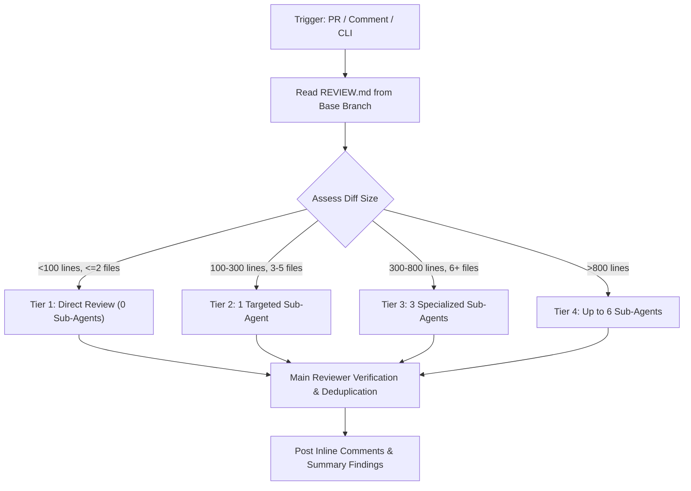

# Kilo Autonomous Code Reviewer

Orchestrates automated AI code reviews across pull requests and local working trees using Kilo Code and repository-owned `REVIEW.md` policy.

## Operational Workflow



## Review Execution Methods

### 1. Local CLI Review

Run locally using `pnpm review` or `kilo run`:

```bash
# Review uncommitted changes (staged + unstaged + untracked)
pnpm review

# Review staged changes only
pnpm review staged

# Review current branch against base branch
pnpm review branch main

# Review specific commit
pnpm review <commit-hash>

# Review GitHub pull request
pnpm review <PR-URL-or-number>
```

### 2. CI/CD GitHub Actions Trigger

Automatic triggers run via `.github/workflows/kilo.yml`:

- **PR Events**: Automatically triggers when a non-draft PR is opened, updated, or reopened by a human.
- **Comment Trigger**: Comment `/kilo`, `/review`, or `/kc` on any issue or PR review comment.
- **Manual Trigger**: Dispatch via GitHub Actions with optional PR number and scope.

## Core Rules & Invariants Checked

Every review applies strict standards defined in `REVIEW.md`:

1. **P0 (Blocker)**: Monorepo boundaries (`apps/*` -> `packages/database`), dark-mode styles (strict light-mode OKLCH), raw `` (use `next/image`), direct client DB queries.
2. **P1 (Critical)**: Performance regressions, N+1 queries, non-serializable RSC props, cache tag leaks, unauthenticated Server Actions.
3. **P2 (Warning)**: Bundle budget breaches (>1.0 MB), missing edge-case unit tests, suboptimal OKLCH token mappings.
4. **P3 (Suggestion)**: Idiomatic refactorings and code clarity improvements.
