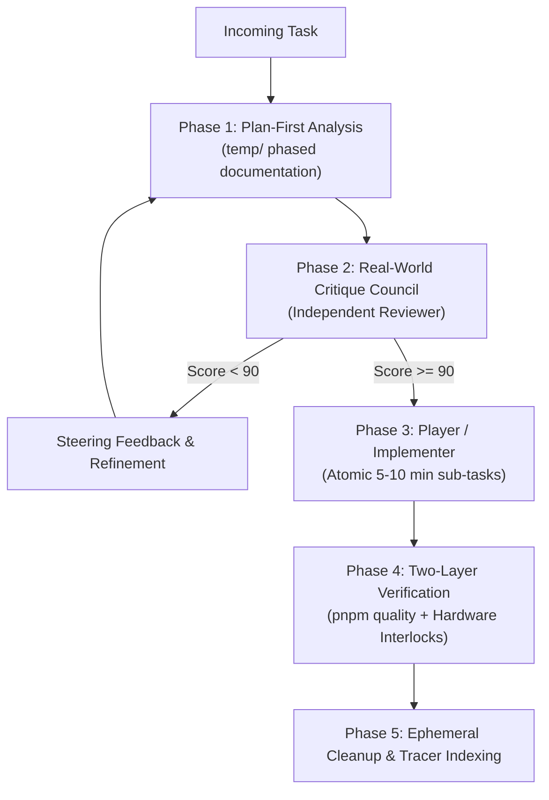

# Kiro-Claude Unified Workflow Runbook

## Overview

This skill implements a high-leverage hybrid operational workflow combining:

- **Kiro-CLI**: Specialized domain roles (Architect, Implementer, Isolated Critic), Player/Coach delegation topology, lifecycle steering hooks, and strict blast-radius containment.
- **Claude-Code**: Single Source of Truth (`AGENTS.md` / `CLAUDE.md`), Plan-then-Execute mode (`temp/` phased pipeline), automated test/lint verification loops, lean session context management, and worktree isolation.

---

## 1. The Dual-Mind Execution Topology

---

## 2. Step-by-Step Runbook

### Step 1: Plan-First Documentation

- For any task touching >2 files or modifying core business logic, maintain the `temp/` pipeline:
  - `temp/outline.md`: Strategic vision and Council viewpoints.
  - `temp/requirements.md`: EARS notation requirements with error paths and edge cases.
  - `temp/design.md`: Technical contracts, sequence diagrams, and database topologies.
  - `temp/tasks.md`: Phased execution waves with Real-World Quality Score $\ge 90/100$.

### Step 2: Isolated Critic Review (Blast Radius Containment)

- Dispatch an isolated reviewer subagent with read-only permissions to evaluate the plan.
- The reviewer must NOT see the implementer's internal chain-of-thought to avoid confirmation bias.

### Step 3: Atomic Implementation (Player)

- Execute changes in small, discrete steps (5–10 minute atomic units).
- Respect package boundaries defined in `tools/repo/policy-compiler.cjs`.

### Step 4: Two-Layer Verification Loop

- Run automated quality gates: `pnpm quality` (lint, type-check, tests, token checks, policy checks, RLS audits).
- Verify real-world hardware fallbacks and operator feedback mechanisms.

### Step 5: Retrospective & Cleanup

- Log any encountered errors and resolutions into `.memory_base/retrospectives/`.
- Clean up scratch scripts and temp test files.
- Record the immutable task execution log in `archive/tracers/log/` and index in `archive/tracers/README.md`.
