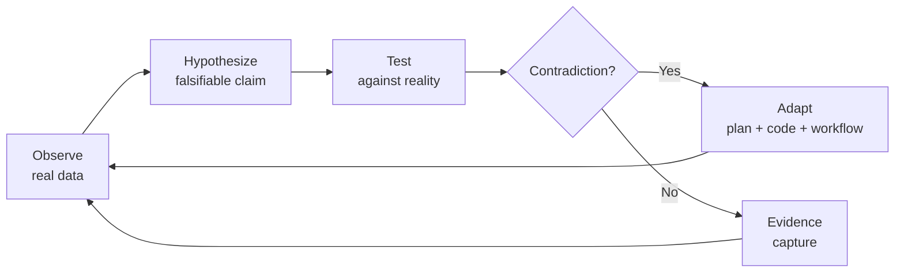

# Adaptive Real-World Reasoning (ARWR) Workflow

**Project:** Arch-System — Next.js 16 Cache Components & Proxy Modernization  
**Companion to:** Verified Real-World Validation Workflow (VRWV)  
**Governing Rule:** **ARWR-0 — Adaptive Real-World Reasoning is mandatory at every step. No output, decision, or claim is accepted without it.**  
**Status:** Workflow template — must be executed against the live repository, runtime, and real data.

---

## 0. The ARWR Rule (Non-Negotiable)

> **ARWR-0:** Every action, thought, plan, output, and conclusion in this workflow MUST be derived from and continuously re-anchored to verified real-world data. Plans, assumptions, memory, and prior outputs are never sufficient evidence. When reality contradicts the plan, reality wins — and the plan, code, and workflow adapt immediately.

### 0.1 The Seven ARWR Constraints

| ID         | Constraint          | Meaning                                                               | Violation Example                                                         |
| :--------- | :------------------ | :-------------------------------------------------------------------- | :------------------------------------------------------------------------ |
| **ARWR-1** | **Reality-first**   | Observed behavior outranks intended behavior.                         | Marking `proxy.ts` as working because it was written, without running it. |
| **ARWR-2** | **Evidence-bound**  | Every claim requires a fresh, timestamped artifact.                   | Citing the plan as proof a file exists.                                   |
| **ARWR-3** | **Adaptive**        | New real-world data updates the plan, code, and this workflow.        | Ignoring a failing build because the plan said it should pass.            |
| **ARWR-4** | **Self-correcting** | Each gate must challenge prior gates' conclusions.                    | Trusting Gate 1 after a runtime change invalidates it.                    |
| **ARWR-5** | **Context-aware**   | Reasoning must account for environment, tenant, version, and runtime. | Assuming Node behavior in Edge Runtime.                                   |
| **ARWR-6** | **Falsifiable**     | Every claim must be stated so it can be disproven.                    | "Cache works" instead of "TTL on `dept:{slug}:reports` is 300s ± 1s."     |
| **ARWR-7** | **Traceable**       | Every decision links to Evidence ID → Action ID → Outcome ID.         | An unlogged change to tag naming.                                         |

### 0.2 ARWR Reasoning Loop



**Loop rule:** The loop never terminates. Every gate re-enters Observe with fresh data.

---

## 1. Scope & Sources of Truth

| Item                     | Value            | Evidence ID | Freshness |
| :----------------------- | :--------------- | :---------- | :-------- |
| Repository               | `<repo-url>`     | EV-0-01     | `<ts>`    |
| Commit SHA               | `<sha>`          | EV-0-02     | `<ts>`    |
| Branch                   | `<branch>`       | EV-0-03     | `<ts>`    |
| Next.js version          | `<version>`      | EV-0-04     | `<ts>`    |
| Node.js version          | `<version>`      | EV-0-05     | `<ts>`    |
| Runtime                  | `Node / Edge`    | EV-0-06     | `<ts>`    |
| Redis endpoint           | `<url>`          | EV-0-07     | `<ts>`    |
| DB                       | `<name/version>` | EV-0-08     | `<ts>`    |
| Test environment         | `<env>`          | EV-0-09     | `<ts>`    |
| Tenant(s) under test     | `<ids>`          | EV-0-10     | `<ts>`    |
| Department(s) under test | `<slugs>`        | EV-0-11     | `<ts>`    |

> **ARWR-5 check:** Every row must reflect the _current_ environment, not a remembered one.

---

## 2. ARWR Enforcement Roles

| Role                  | ARWR Duty                                                                                                                   |
| :-------------------- | :-------------------------------------------------------------------------------------------------------------------------- |
| **Reasoner**          | Owns the Observe→Hypothesize→Test→Adapt loop per gate.                                                                      |
| **Challenger**        | Attempts to falsify every claim; must find at least one contradiction or declare "no contradiction found after N attempts." |
| **Adaptation Scribe** | Records every plan/code/workflow change triggered by reality.                                                               |
| **Evidence Auditor**  | Confirms every claim has a fresh, timestamped artifact.                                                                     |
| **Rollback Owner**    | Proves rollback works with real commands.                                                                                   |

**Rule:** No single person may hold both Reasoner and Challenger for the same gate.

---

## 3. ARWR Gate Framework

Each gate follows the same structure:

1. **Observe** — collect fresh real-world data.
2. **Hypothesize** — state falsifiable claims from the plan.
3. **Test** — run real commands / requests / queries.
4. **Compare** — expected vs actual.
5. **Adapt** — if contradiction, update plan/code/workflow and log it.
6. **Evidence** — capture artifacts.
7. **Challenge** — independent falsification attempt.
8. **Exit or Block.**

---

### Gate 0 — Reality Baseline (ARWR Anchor)

**Observe**

```bash
git fetch --all
git status --short
git rev-parse HEAD
git branch --show-current
node -v
pnpm -v
pnpm list next
test -f apps/portal/proxy.ts && echo "proxy.ts present" || echo "proxy.ts MISSING"
test -f apps/portal/middleware.ts && echo "middleware.ts present" || echo "middleware.ts absent"
redis-cli PING
```

**Hypothesize (falsifiable)**

- H0.1: "The repo is at commit `<sha>` with no uncommitted changes."
- H0.2: "Next.js version is `<expected>`."
- H0.3: "`proxy.ts` exists and `middleware.ts` does not."
- H0.4: "Redis is reachable."

**Test / Compare / Evidence**

| Claim | Expected                  | Actual     | Evidence ID | Status      |
| :---- | :------------------------ | :--------- | :---------- | :---------- |
| H0.1  | Clean at `<sha>`          | `<actual>` | EV-0-01     | `PASS/FAIL` |
| H0.2  | `<version>`               | `<actual>` | EV-0-04     | `PASS/FAIL` |
| H0.3  | proxy yes / middleware no | `<actual>` | EV-0-02     | `PASS/FAIL` |
| H0.4  | `PONG`                    | `<actual>` | EV-0-07     | `PASS/FAIL` |

**Adapt**

- If any hypothesis fails, update the plan's assumptions _before_ proceeding.
- Log adaptation in §7.

**Challenge**

- Challenger re-runs commands in a clean shell and from a different working directory.

**Exit Criteria**

- All hypotheses verified OR documented exceptions with ADRs.
- Baseline captured fresh within the last `<N>` minutes.

---

### Gate 1 — Static Alignment (ARWR Applied to Files)

**Observe**

```bash
git diff --name-only <base>..<head>
rg "middleware" apps/portal --glob '!node_modules'
rg "next/legacy/image" .
rg "images\.domains" .
rg "revalidateTag\(" .
rg "updateTag\(" .
rg "cacheLife\(" .
rg "cacheTag\(" .
tsc --noEmit
pnpm --filter portal lint
pnpm --filter portal build
```

**Hypothesize**

- H1.1: "No deprecated `middleware.ts` references remain."
- H1.2: "All planned files exist with expected exports."
- H1.3: "Typecheck, lint, and build pass."

**ARWR-6 Falsifiability Check**

| Hypothesis | Falsification Test                               | Result     |
| :--------- | :----------------------------------------------- | :--------- |
| H1.1       | `rg "middleware"` returns 0 non-allowlisted hits | `<result>` |
| H1.2       | `test -f` each planned file + export grep        | `<result>` |
| H1.3       | CI-equivalent local run                          | `<result>` |

**Adapt Rule**

- If reality shows an unexpected reference (e.g., a test importing `middleware`), the plan's "delete" action is wrong — update the plan to "rename with shim" and re-run.

**Evidence Table**

| Plan Item          | Expected File                 | Actual     | Evidence ID | Status      |
| :----------------- | :---------------------------- | :--------- | :---------- | :---------- |
| Proxy migration    | `apps/portal/proxy.ts`        | `<actual>` | EV-1-01     | `PASS/FAIL` |
| Middleware removal | absent                        | `<actual>` | EV-1-02     | `PASS/FAIL` |
| Cache primitives   | `lib/server-cache.ts`         | `<actual>` | EV-1-03     | `PASS/FAIL` |
| Config profiles    | `next.config.mjs`             | `<actual>` | EV-1-04     | `PASS/FAIL` |
| Server Actions     | fleet.ts, actions.ts          | `<actual>` | EV-1-05     | `PASS/FAIL` |
| Redis bridge       | `packages/redis/src/index.ts` | `<actual>` | EV-1-06     | `PASS/FAIL` |

**Challenge**

- Challenger greps for the _replacement_ patterns to ensure the migration isn't one-sided.
- Challenger runs the build with `NODE_ENV=production`.

---

### Gate 2 — Functional Runtime (ARWR in the Live App)

**Observe**

```bash
pnpm --filter portal start
curl -i http://localhost:3000/hub
curl -i http://localhost:3000/safety
curl -i http://localhost:3000/engineering
```

Then trigger real mutations through the UI or integration harness.

**Hypothesize**

- H2.1: "Valid session reaches `/hub`, `/safety`, `/engineering`."
- H2.2: "Invalid session is redirected or 401."
- H2.3: "Server Action mutation produces read-your-writes."
- H2.4: "React Query invalidates `['machines']`, `['machine', id]`."

**ARWR-5 Context Check**

| Context Variable | Value         | Impact on Reasoning                          |
| :--------------- | :------------ | :------------------------------------------- |
| Runtime          | `Node / Edge` | Determines Redis availability in `proxy.ts`. |
| Session provider | `<provider>`  | Determines redirect vs 401.                  |
| Tenant           | `<id>`        | Determines which cache keys must exist.      |

**Adapt**

- If Edge Runtime blocks Redis, the plan must adapt: either move session lookup or use a different store.

**Evidence**

| ID      | Scenario       | Expected         | Actual     | Artifact |
| :------ | :------------- | :--------------- | :--------- | :------- |
| EV-2-01 | Valid `/hub`   | 200              | `<actual>` | `<log>`  |
| EV-2-02 | Invalid `/hub` | Redirect/401     | `<actual>` | `<log>`  |
| EV-2-03 | Mutation       | Read-your-writes | `<actual>` | `<log>`  |
| EV-2-04 | React Query    | Fresh            | `<actual>` | `<log>`  |

**Challenge**

- Challenger clears cookies, changes tenant headers, and re-runs.
- Challenger inspects network tab / trace to confirm `proxy.ts` executed.

---

### Gate 3 — Cache & Invalidation (ARWR on State)

**Observe**

```bash
redis-cli KEYS "tenant:*"
redis-cli KEYS "dept:*"
redis-cli TTL "tenant:<id>:machines"
redis-cli GET "dept:<slug>:reports"
```

Then: mutate → re-read Next.js cache → re-read Redis.

**Hypothesize**

- H3.1: "`updateTag()` clears Next.js cache AND Redis L1/L2."
- H3.2: "`revalidateTag(tag, profile)` uses the declared profile."
- H3.3: "TTLs match `CACHE_TTL_REGISTRY`."

**ARWR-3 Adaptation Trigger**

If observed TTL ≠ registry TTL, adapt by:

1. Updating the registry OR
2. Updating the profile OR
3. Documenting the exception.

**Evidence**

| ID      | Layer    | Key                    | Before    | After     | Expected TTL | Actual TTL |
| :------ | :------- | :--------------------- | :-------- | :-------- | :----------- | :--------- |
| EV-3-01 | Next RSC | `machines:<id>`        | `<stale>` | `<fresh>` | `<p>`        | `<a>`      |
| EV-3-02 | Redis L1 | `tenant:<id>:machines` | `<stale>` | `<fresh>` | `<t>`        | `<a>`      |
| EV-3-03 | Redis L2 | `dept:<slug>:reports`  | `<stale>` | `<fresh>` | `<t>`        | `<a>`      |

**Challenge**

- Challenger mutates _one_ tenant and confirms the _other_ tenant is unchanged.
- Challenger simulates a Redis restart and confirms L1 fallback.

---

### Gate 4 — Deprecation Audit (ARWR on Compatibility)

**Observe**

```bash
rg "middleware" .
rg "next/legacy/image" .
rg "images\.domains" .
rg "revalidateTag\([^,)]+\)" .   # single-arg detection
```

**Hypothesize**

- H4.1: "0 deprecated usages remain."
- H4.2: "Any exception is documented with ADR + expiry."

**ARWR-7 Traceability**

| Deprecation                | Replacement                                 | File(s)  | Evidence | ADR      | Expiry   |
| :------------------------- | :------------------------------------------ | :------- | :------- | :------- | :------- |
| `middleware.ts`            | `proxy.ts`                                  | `<file>` | EV-4-01  | `<link>` | `<date>` |
| single-arg `revalidateTag` | `updateTag` / `revalidateTag(tag, profile)` | `<file>` | EV-4-02  | `<link>` | `<date>` |
| `next/legacy/image`        | `next/image`                                | `<file>` | EV-4-03  | `<link>` | `<date>` |
| `images.domains`           | `images.remotePatterns`                     | `<file>` | EV-4-04  | `<link>` | `<date>` |

**Challenge**

- Challenger writes a temporary file using a deprecated pattern and confirms the linter/CI blocks it.

---

### Gate 5 — Related Files & Dependency Graph (ARWR on Blast Radius)

**Observe**

```bash
git diff --name-only <base>..<head>
rg "from ['\"].*server-cache['\"]" .
rg "from ['\"].*proxy['\"]" .
rg "revalidateTag|updateTag|cacheLife|cacheTag" .
pnpm depcruise apps/portal
```

**Hypothesize**

- H5.1: "Every API consumer is updated."
- H5.2: "No forbidden cycles introduced."
- H5.3: "No orphan imports."

**Adapt**

- If a consumer exists that the plan didn't list, update the plan and re-run Gate 1.

**Evidence**

| ID      | Check               | Result    | Artifact |
| :------ | :------------------ | :-------- | :------- |
| EV-5-01 | Diff file list      | `<paste>` | `<link>` |
| EV-5-02 | Dependency graph    | `<paste>` | `<link>` |
| EV-5-03 | Consumer call sites | `<paste>` | `<link>` |

**Challenge**

- Challenger picks 3 random changed files and traces every import in and out.

---

### Gate 6 — Real-World Data & Tenant Isolation (ARWR on Ground Truth)

**Observe**

Use production-like data:

```sql
SELECT id, slug FROM tenants WHERE id IN ('<a>', '<b>');
SELECT id, slug FROM departments WHERE slug IN ('<x>', '<y>');
```

```bash
redis-cli KEYS "tenant:<a>:*"
redis-cli KEYS "tenant:<b>:*"
redis-cli KEYS "dept:<x>:*"
redis-cli KEYS "dept:<y>:*"
```

**Hypothesize**

- H6.1: "Tenant A cannot read Tenant B's cached data."
- H6.2: "Department X invalidation does not clear Department Y."
- H6.3: "Tag scoping matches the documented convention."

**ARWR-1 Reality Check**

- If a leak is found, the plan is wrong — not the data. Stop and remediate.

**Evidence**

| ID      | Tenant | Dept  | Resource | Expected | Actual     | Status      |
| :------ | :----- | :---- | :------- | :------- | :--------- | :---------- |
| EV-6-01 | `<a>`  | `<x>` | Machines | Isolated | `<actual>` | `PASS/FAIL` |
| EV-6-02 | `<b>`  | `<y>` | Reports  | Isolated | `<actual>` | `PASS/FAIL` |

**Challenge**

- Challenger attempts cross-tenant reads using crafted headers, cookies, or query params.

---

### Gate 7 — Adaptive Sign-Off

**Observe**

```bash
pnpm --filter portal test
pnpm --filter portal test:e2e
corpos tick codebase-health
corpos status
```

**Hypothesize**

- H7.1: "All gates pass."
- H7.2: "No unresolved contradictions remain."
- H7.3: "Adaptations are logged and reflected in the plan."

**ARWR-4 Self-Correction**

- Re-run Gate 0 commands. If baseline changed, invalidate prior gates and re-run.

**Sign-Off**

| Role              | Name     | ARWR Attestation                                                    | Decision         | Date     | Evidence Bundle |
| :---------------- | :------- | :------------------------------------------------------------------ | :--------------- | :------- | :-------------- |
| Reasoner          | `<name>` | "I applied ARWR-1..7 to every claim."                               | `APPROVE/REJECT` | `<date>` | `<link>`        |
| Challenger        | `<name>` | "I attempted falsification and found no unresolved contradictions." | `APPROVE/REJECT` | `<date>` | `<link>`        |
| Adaptation Scribe | `<name>` | "All adaptations are logged in §7."                                 | `APPROVE/REJECT` | `<date>` | `<link>`        |
| Evidence Auditor  | `<name>` | "Every claim has a fresh artifact."                                 | `APPROVE/REJECT` | `<date>` | `<link>`        |
| Rollback Owner    | `<name>` | "Rollback rehearsed with real commands."                            | `APPROVE/REJECT` | `<date>` | `<link>`        |

---

## 4. Evidence Register (ARWR-Enforced)

| Evidence ID | Gate | Type    | Source     | Command/Query        | Result      | Freshness | Artifact | Verified By |
| :---------- | :--- | :------ | :--------- | :------------------- | :---------- | :-------- | :------- | :---------- |
| EV-0-01     | 0    | Command | Git        | `git rev-parse HEAD` | `<sha>`     | `<ts>`    | `<link>` | `<name>`    |
| EV-1-01     | 1    | File    | `proxy.ts` | `cat`                | `<content>` | `<ts>`    | `<link>` | `<name>`    |
| EV-3-01     | 3    | Redis   | Redis CLI  | `TTL`                | `<value>`   | `<ts>`    | `<link>` | `<name>`    |
| ...         | ...  | ...     | ...        | ...                  | ...         | ...       | ...      | ...         |

**Freshness rule (ARWR-2):** Any artifact older than the last code change is invalid and must be re-captured.

---

## 5. Traceability Matrix (ARWR-7)

| Plan Item        | Expected Change                        | File(s)                       | Test / Evidence  | Adaptation? | Status        |
| :--------------- | :------------------------------------- | :---------------------------- | :--------------- | :---------- | :------------ |
| Proxy migration  | Add `proxy.ts`, remove `middleware.ts` | `apps/portal/proxy.ts`        | EV-1-01, EV-2-01 | `<yes/no>`  | `<PASS/FAIL>` |
| Cache primitives | `cacheLife`, `cacheTag`, `updateTag`   | `lib/server-cache.ts`         | EV-1-03, EV-3-01 | `<yes/no>`  | `<PASS/FAIL>` |
| Redis bridge     | Tag → Redis invalidation               | `packages/redis/src/index.ts` | EV-3-02          | `<yes/no>`  | `<PASS/FAIL>` |
| Server Actions   | Replace `revalidateTag(tag, "max")`    | `fleet.ts`, `actions.ts`      | EV-1-05, EV-2-03 | `<yes/no>`  | `<PASS/FAIL>` |
| Config           | Add `cacheLife` profiles               | `next.config.mjs`             | EV-1-04          | `<yes/no>`  | `<PASS/FAIL>` |

---

## 6. ARWR Reasoning Log (per gate)

| Gate | Observation | Hypothesis | Test    | Contradiction? | Adaptation | Evidence |
| :--- | :---------- | :--------- | :------ | :------------- | :--------- | :------- |
| 0    | `<obs>`     | `<H>`      | `<cmd>` | `YES/NO`       | `<change>` | EV-0-01  |
| 1    | `<obs>`     | `<H>`      | `<cmd>` | `YES/NO`       | `<change>` | EV-1-01  |
| 2    | `<obs>`     | `<H>`      | `<cmd>` | `YES/NO`       | `<change>` | EV-2-01  |
| 3    | `<obs>`     | `<H>`      | `<cmd>` | `YES/NO`       | `<change>` | EV-3-01  |
| 4    | `<obs>`     | `<H>`      | `<cmd>` | `YES/NO`       | `<change>` | EV-4-01  |
| 5    | `<obs>`     | `<H>`      | `<cmd>` | `YES/NO`       | `<change>` | EV-5-01  |
| 6    | `<obs>`     | `<H>`      | `<cmd>` | `YES/NO`       | `<change>` | EV-6-01  |
| 7    | `<obs>`     | `<H>`      | `<cmd>` | `YES/NO`       | `<change>` | EV-7-01  |

---

## 7. Adaptation Log (ARWR-3)

| ID    | Trigger (real-world data) | Original Plan | Adapted To | Files Changed | Gate Re-entered | Owner    |
| :---- | :------------------------ | :------------ | :--------- | :------------ | :-------------- | :------- |
| AD-01 | `<observation>`           | `<old>`       | `<new>`    | `<files>`     | `<gate>`        | `<name>` |

**Rule:** No adaptation is valid unless it cites the triggering evidence.

---

## 8. Assumption Register (ARWR-6)

| ID    | Assumption                      | Falsification Test                   | Result     | Status               |
| :---- | :------------------------------ | :----------------------------------- | :--------- | :------------------- |
| AS-01 | `proxy.ts` runs in Edge Runtime | Inspect runtime config + runtime log | `<result>` | `VERIFIED/FALSIFIED` |
| AS-02 | `updateTag()` is synchronous    | Measure with trace                   | `<result>` | `VERIFIED/FALSIFIED` |
| AS-03 | Tenant tags are mandatory       | Cross-tenant read attempt            | `<result>` | `VERIFIED/FALSIFIED` |

---

## 9. Failure Handling & Rollback (ARWR-Proven)

| Failure                  | Immediate Action            | Rollback Command (real) | Re-entry Gate |
| :----------------------- | :-------------------------- | :---------------------- | :------------ |
| `proxy.ts` not executing | Restore middleware behavior | `git revert <sha>`      | 0             |
| Cache mismatch           | Disable `cacheComponents`   | `git revert <sha>`      | 1             |
| Redis stale              | Disable bridge call         | `git revert <sha>`      | 3             |
| Cross-tenant leak        | Halt release                | `git revert <sha>`      | 6             |
| Build failure            | Fix or revert               | `git revert <sha>`      | 1             |

**Rule:** Rollback must be rehearsed at least once in a non-production environment with the real command output captured.

---

## 10. Final ARWR Report Template

```md
# ARWR Report — <commit-sha>

## ARWR Attestation

- ARWR-1 Reality-first: PASS/FAIL
- ARWR-2 Evidence-bound: PASS/FAIL
- ARWR-3 Adaptive: PASS/FAIL
- ARWR-4 Self-correcting: PASS/FAIL
- ARWR-5 Context-aware: PASS/FAIL
- ARWR-6 Falsifiable: PASS/FAIL
- ARWR-7 Traceable: PASS/FAIL

## Gate Summary

| Gate | Status    | Contradictions Found | Adaptations | Evidence |
| :--- | :-------- | :------------------- | :---------- | :------- |
| 0    | PASS/FAIL | <n>                  | <n>         | <link>   |
| ...  | ...       | ...                  | ...         | ...      |

## Adaptations Applied

- <AD-id>: <summary>

## Unresolved Contradictions

- <list or "none">

## Verified Real-World Data

- Commit: <sha>
- Next.js: <version>
- Runtime: <env>
- Tenants verified: <ids>
- Departments verified: <slugs>
- Redis keys sampled: <list>

## Recommendation

- Release / Hold / Rollback
- Rationale: <evidence-bound reasoning>
```

---

## 11. ARWR Command Reference

> Replace with real scripts. If a script does not exist, record as gap and adapt.

```bash
# Baseline
git fetch --all && git status --short && git rev-parse HEAD
node -v && pnpm -v && pnpm list next

# Static
rg "middleware" apps/portal
rg "next/legacy/image" .
rg "images\.domains" .
rg "revalidateTag\(" .
rg "updateTag\(" .
rg "cacheLife\(" .
rg "cacheTag\(" .
tsc --noEmit
pnpm --filter portal lint
pnpm --filter portal build

# Runtime
pnpm --filter portal start
curl -i http://localhost:3000/hub
curl -i http://localhost:3000/safety
curl -i http://localhost:3000/engineering

# Cache / Redis
redis-cli PING
redis-cli KEYS "tenant:*"
redis-cli KEYS "dept:*"
redis-cli TTL "tenant:<id>:machines"
redis-cli GET "dept:<slug>:reports"

# Dependency
pnpm depcruise apps/portal

# Health
corpos tick codebase-health
corpos status
```

---

## 12. ARWR Non-Negotiable Checklist

- [ ] Every gate re-entered Observe before concluding.
- [ ] Every claim has a fresh, timestamped Evidence ID.
- [ ] Every contradiction triggered an Adaptation Log entry.
- [ ] Every assumption has a falsification test and a result.
- [ ] Every decision links Evidence → Action → Outcome.
- [ ] Tenant/department isolation verified with real data.
- [ ] Rollback proven with real commands.
- [ ] Challenger signed off on each gate.
- [ ] Final report includes the ARWR Attestation block.

---

**End of ARWR Workflow**  
_Reality is the arbiter. The workflow adapts or it stops._
