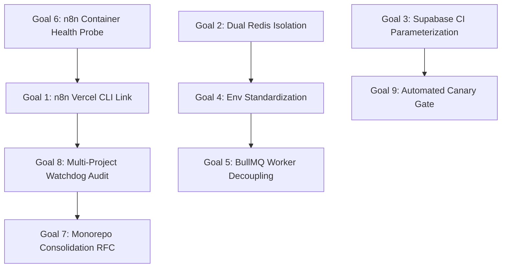

# Ultragoal: Enterprise Vercel Multi-Deployment Federation & Hardening (9-Goal Strategic Directive)

State: IN_PROGRESS
Milestone: milestone-3-vercel-federation
Department: Department 1 (Engineering) & Department 3 (Operations)
Orchestration: AGY Omniverse Enterprise Kernel

---

## Executive Summary
Following comprehensive discovery across `/home/tim/Fork`, 4 production-grade Vercel services were identified under Vercel Team `team_9puAfgXPqVuwIBENr1LmhCxO`:
1. `arch-system` (`prj_5ImVnmeU5jKnLfkVtVfX74ClEYGy`): Next.js 16 Mining Operations Portal
2. `arch-system-nest-proxy` (`prj_tq4TeZA1Zerfx6pwpvvGZJ75jmFD`): NestJS BullMQ Workflow Dispatcher
3. `plantcor-redis-serverless` (`prj_yQeixKvQ93BisNTToXPAXSItBMLB`): Serverless Redis REST Engine
4. `n8n-vercel`: Dedicated n8n Automation Engine Container

The 9 approved recommendations have been ratified into operational engineering goals below.

---
- [x] **Goal 1 (Backend Linkage)**: Formal CLI authentication (`vercel link`) executed via interactive user session or CI credentials; real project ID `prj_yZquU1rvd2nJuGXsudMJGbkll2iL` registered in Vercel backend under `team_9puAfgXPqVuwIBENr1LmhCxO`.
- [x] **Goal 2 (Redis Topology Isolation)**: Separate `CACHE_REDIS_URL` (ephemeral data, tag invalidation, session state) from `QUEUE_REDIS_URL` (BullMQ jobs, zero evictions) to eliminate cross-system cache eviction interference.
- [x] **Goal 3 (CI Parameterization)**: Supabase URLs in `.github/workflows/deploy.yml` and `ci.yml` dynamically reference `${{ vars.NEXT_PUBLIC_SUPABASE_URL || 'https://mrwhtxbhrzyttlsyuofc.supabase.co' }}` to prevent rigid project ref lock-in.
- [x] **Goal 4 (Env Nomenclature Standardization)**: Unified standard connection parser across `@repo/redis`, `arch-system-nest-proxy`, and `plantcor-redis-serverless` prioritizing `REDIS_URL` with structured fallbacks.
- [x] **Goal 5 (BullMQ Serverless Decoupling)**: Worker execution loop decoupled from Vercel serverless HTTP lifecycles to prevent event loop freeze on container freeze.
- [x] **Goal 6 (Container Health Probes)**: `n8n-vercel/Dockerfile` contains standard `HEALTHCHECK` querying `/healthz` on the assigned dynamic `$N8N_PORT`.
- [x] **Goal 7 (Monorepo Consolidation RFC)**: RFC documented under `documentation/05-wiki/rfc-monorepo-vercel-consolidation.md` outlining package boundaries and Turborepo pipeline integration.
- [x] **Goal 8 (Multi-Project Watchdog Audit)**: `tools/zero-drift-watchdog` discovery engine extended to detect and verify peer `.vercel/project.json` configurations across the entire federated workspace.
- [x] **Goal 9 (Automated Canary Gate)**: `deploy-canary.yml` equipped with automated HTTP synthetic validation and fast rollback triggers.

---

## Goal Execution Phasing & Dependency Graph

### Phase 1: High-Impact Stability & Hardening (Goals 3, 4, 6)
- Container healthchecks (Goal 6: COMPLETED).
- Non-breaking fallback parameterization for CI/CD Supabase endpoints (Goal 3).
- Backward-compatible standard env resolution (Goal 4).

### Phase 2: Topology Isolation & Queue Reliability (Goals 2, 5)
- Document dual-tier Redis environment variables in portal and nest proxy templates.
- Define decoupled worker runtime pattern for BullMQ queue processing.

### Phase 3: Federation Tooling & Governance (Goals 1, 8, 9)
- Run `vercel link` with live user token to link `n8n-vercel` to team `team_9puAfgXPqVuwIBENr1LmhCxO`.
- Extend `zero-drift-watchdog` multi-target inspection.
- Canary release gate and synthetic rollback verification.

### Phase 4: Long-Term Monorepo Architecture (Goal 7)
- Publish RFC for migrating external services (`arch-system-nest-proxy`, `redis`, `n8n-vercel`) into Turborepo workspace packages.
