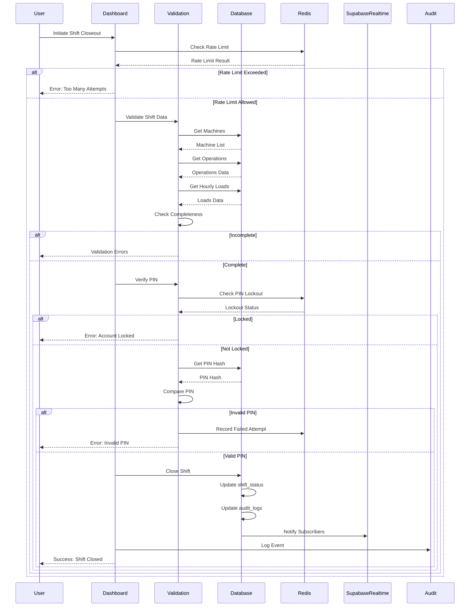
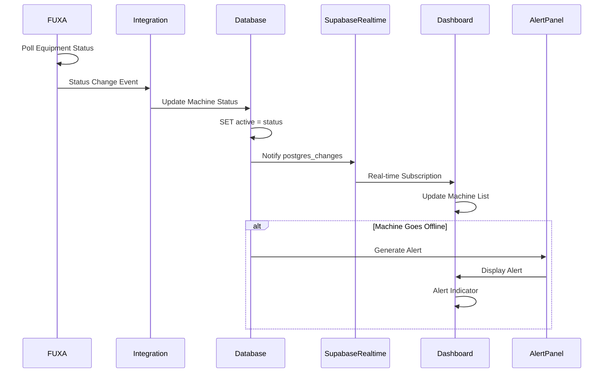
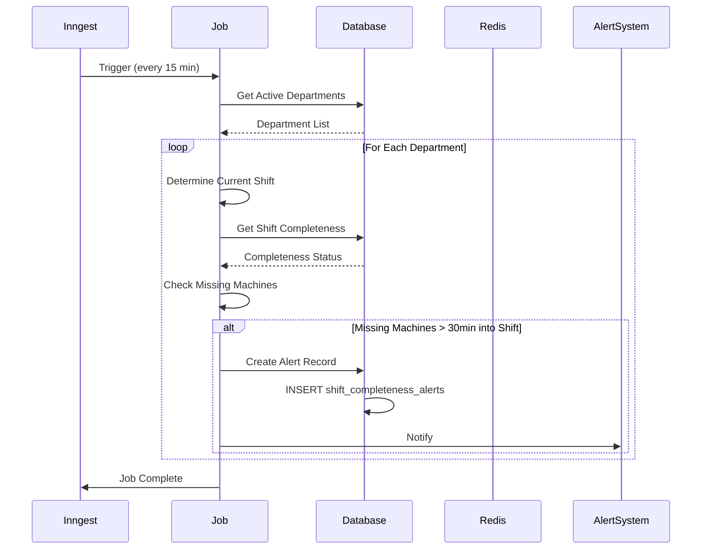
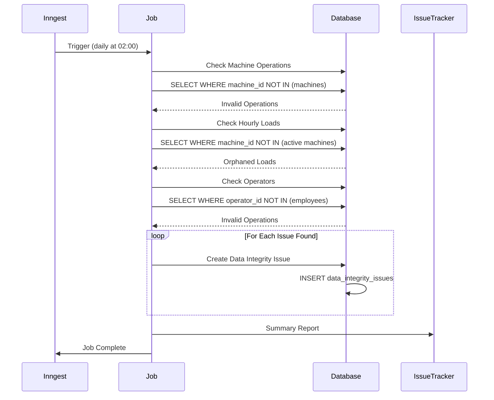
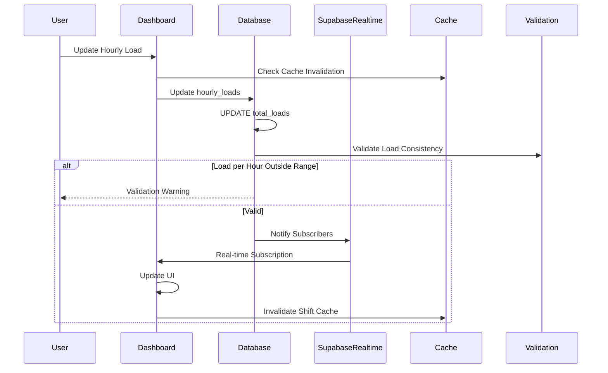
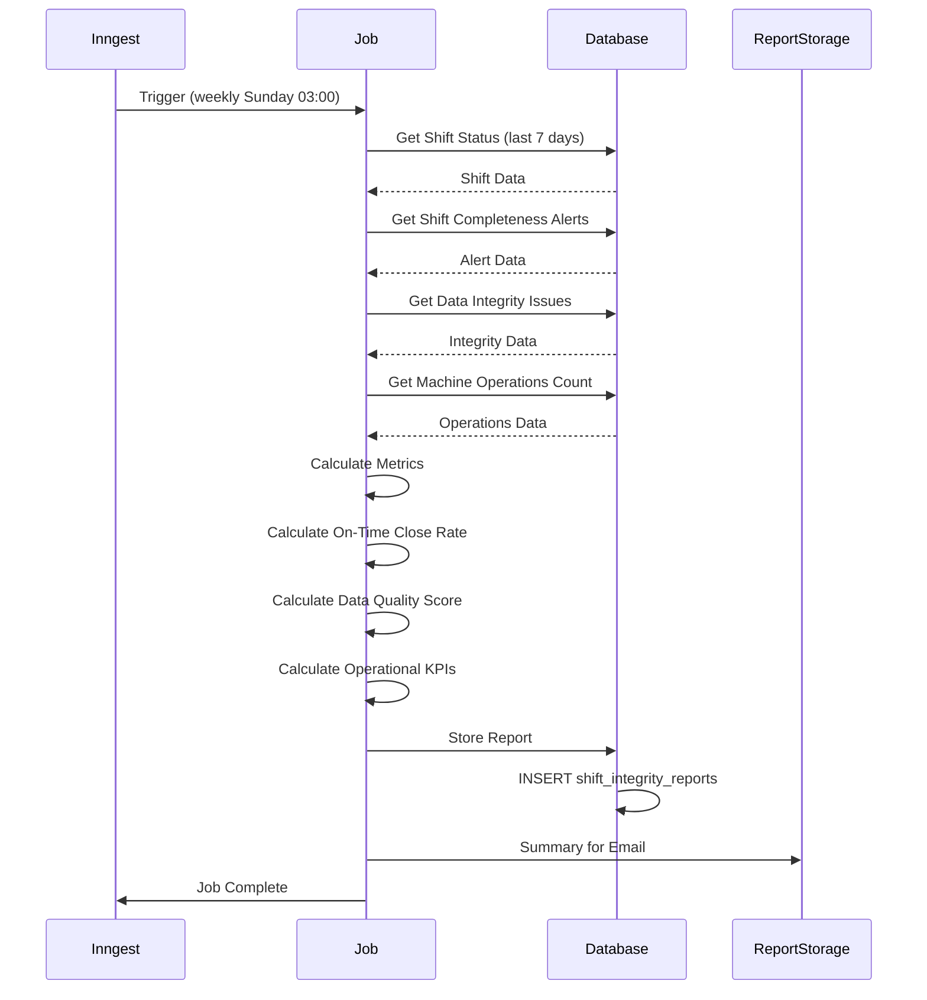
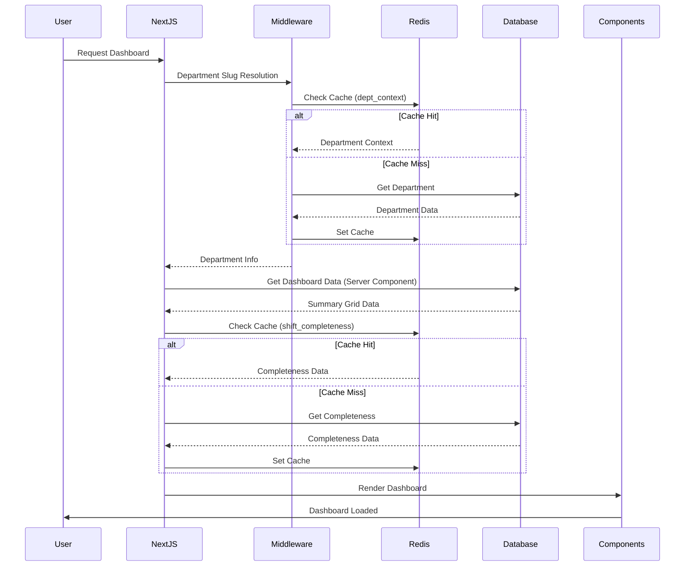
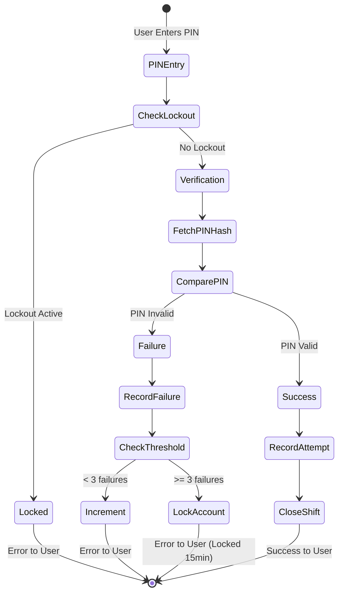

# Data Flow Diagrams

**Last Updated:** 2026-06-15  
**Version:** 1.0  
**Audience:** Developers, System Architects

---

## Overview

This document provides detailed data flow diagrams for key Control Room system processes.

## Flow 1: Shift Closeout



## Flow 2: Machine Status Update (SCADA Integration)



## Flow 3: Shift Completeness Check (Scheduled Job)



## Flow 4: Orphaned Record Detection (Scheduled Job)



## Flow 5: Real-Time Hourly Loads Update



## Flow 6: Shift Integrity Report (Weekly)



## Flow 7: Dashboard Load with Caching



## Flow 8: PIN Verification with Lockout



## Component Data Flow

### SCADA Panel Data Flow

```
FUXA SCADA Server
    ↓ (HTTP/iframe)
SCADA Panel Component
    ↓ (props)
Machine List View
    ↓ (subscription)
Supabase Realtime
    ↓ (postgres_changes)
Machine Status Updates
```

### Alert Panel Data Flow

```
Database (machines table)
    ↓ (trigger)
Supabase Realtime
    ↓ (subscription)
Alert Panel Component
    ↓ (state)
Alert List UI
    ↓ (user action)
Acknowledge/Dismiss
    ↓ (mutation)
Database Update
```

### Shift Coverage Widget Data Flow

```
Database (shift_status, daily_logs)
    ↓ (server component)
Shift Coverage Widget
    ↓ (computed)
Completeness Status
    ↓ (render)
Shift Coverage UI
```

## External System Integration

### FUXA SCADA Integration

**Data Flow:**

```
Equipment → MQTT/Modbus → FUXA → Status Update → Integration Script → Database → Realtime Subscription → UI Update
```

**Fallback Flow:**

```
FUXA Down → Cached Data → UI Display (Stale) → Connection Retry → FUXA Up → Real-time Update
```

### Inngest Job Integration

**Data Flow:**

```
Cron Trigger → Inngest API → Job Execution → Database Queries → Data Processing → Database Updates → Job Completion → Telemetry Logging
```

## Cache Layer Data Flow

### Read Path (Cache Hit)

```
Request → Cache Lookup → Cache Hit → Return Data
```

### Read Path (Cache Miss)

```
Request → Cache Lookup → Cache Miss → Database Query → Cache Set → Return Data
```

### Write Path (Cache Invalidation)

```
Write Operation → Database Update → Cache Invalidate → Next Read = Cache Miss → Fresh Data
```

## Security Data Flow

### Authentication Flow

```
User Credentials → Supabase Auth → JWT Token → Cookie Set → Next Request → Token Validation → User Context
```

### Authorization Flow

```
User Context → RLS Policy Check → Database Query → Filtered Results → UI Display
```

### Rate Limiting Flow

```
Request → Rate Limit Check (Redis) → Counter Increment → Allowed? → Process Request / Return 429
```

## Monitoring Data Flow

### OpenTelemetry Span Flow

```
Operation Start → Create Span → Add Attributes → Add Events → Operation End → Export to OTEL Backend → Dashboard Display
```

### Prometheus Metrics Flow

```
Operation → Metric Increment/Histogram Record → Metric Registry → /api/metrics/prometheus → Prometheus Scrape → Grafana Dashboard → Alert Evaluation
```

## Summary

These data flow diagrams illustrate:

1. **Shift Closeout:** End-to-end process with validation, PIN verification, and database updates
2. **SCADA Integration:** Real-time status updates from FUXA to UI
3. **Scheduled Jobs:** Automated background processes for completeness and integrity
4. **Caching:** Cache lookup, miss, and invalidation patterns
5. **Security:** Authentication, authorization, and rate limiting flows
6. **Monitoring:** Observability data collection and display

---

**Last Review:** 2026-06-15  
**Next Review:** 2026-09-15 (quarterly)
