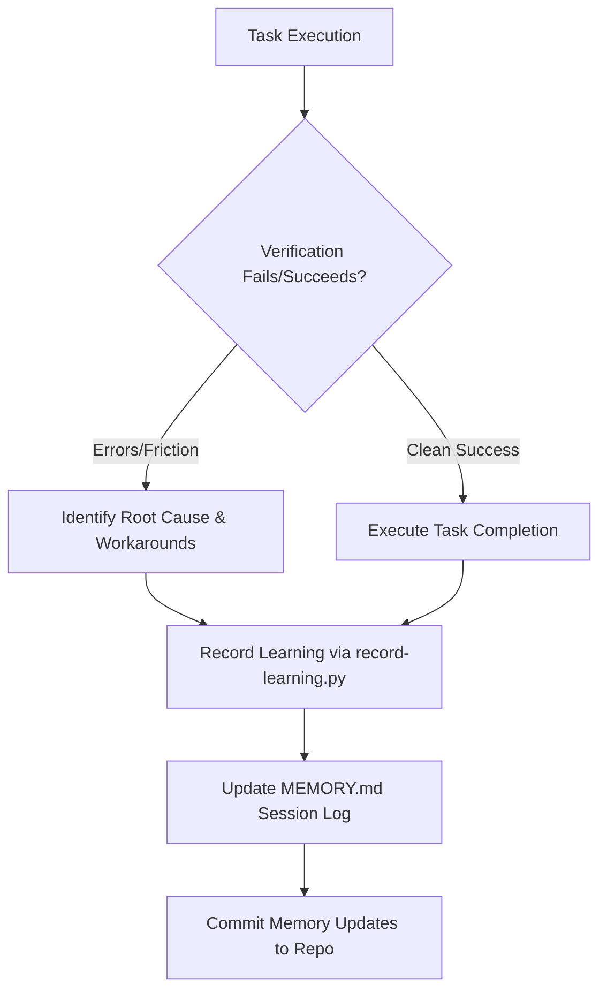

# AI Coding and Constant Improvement Handbook

## 1. Introduction to Agentic Coding
Agentic AI systems operate beyond standard chat interfaces by executing cognitive loops (observation $\rightarrow$ reasoning $\rightarrow$ planning $\rightarrow$ execution $\rightarrow$ verification). This handbook details best practices for agentic software engineering and continuous self-improvement in complex multi-package monorepos.

---

## 2. Cognitive Loops & Horizon Management

### Effort Triage
Before any task, classify the complexity of the requirement to allocate the appropriate cognitive resources:
1. **Low-Tier Effort**:
   - **Characteristics**: Scoped, direct edits or simple codebase reads.
   - **Action**: Run targeted `grep` / `rg` searches and write code directly. No planning in `HOW.md` is needed.
2. **Medium-Tier Effort**:
   - **Characteristics**: Multi-file edits or scoped refactoring.
   - **Action**: Write a checklist plan in `HOW.md` and perform local testing of touched files.
3. **High-Tier Effort**:
   - **Characteristics**: Large structural refactoring, dependency updates, database migration, or cross-package adjustments.
   - **Action**: Detailed Checklist Plan, sub-agent delegation, parallel tasks, strict verify-gate reviews, and peer consensus.

### Planning with `HOW.md`
The `HOW.md` file is the active implementation blueprint. It must be created or updated *before* writing production code.
- Always include an **active task boundary map**.
- Create a **TodoWrite Checklist** containing discrete, sequential steps.
- Track verification metrics, API contracts, and architectural decisions.

---

## 3. The Self-Improvement Loop

A self-improvement loop enables the agent to capture, record, and persist critical learnings across session boundaries.



### Protocol for Recording Learnings
1. **Analyze Friction**: If a shell tool fails, a package script breaks, or a git collision occurs, analyze *why* it happened and note the precise solution/workaround.
2. **Run Learning Script**:
   ```bash
   python3 ops/lending-library/record-learning.py \
     --topic "<topic-slug>" \
     --summary "<precise-lesson-learned>" \
     --tags "tag1,tag2" \
     --refs "path/to/affected/files"
   ```
   This registers the learning in the project's runtime log (`run/agent-learnings.jsonl`).
3. **Append to `MEMORY.md`**: Update the persistent `Session log` table in the project's root `MEMORY.md` to ensure future agents inherit the context.
4. **Commit & Stage**: Check in the updated learning documentation to git.

---

## 4. Context Compaction & Memory Protocols

Large conversations lead to context window bloat, causing models to lose track of system rules and local conventions.

### Manual / Automatic Compaction Loop
* **Compaction Trigger**: Compaction is performed manually using `/summarize` or automatically after a set threshold of user turns (e.g. 10 turns).
* **Wrap-up Protocol**:
  1. Complete all open `HOW.md` checklist items.
  2. Run the codebase verification gates (`verify-gate.sh`, local package lints, unit tests).
  3. Commit changes to git and resolve any untracked or dirty state.
  4. Write a session brief in `.ai_content/.memory/.cursor-memory/sessions/`.
  5. Distill the current active context into `.compact-staging.md`.
  6. Re-write `active-context.md` and prune the active message history.

---

## 5. Frontier Agentic Patterns (Opus, Gemini, GPT-5)

Modern agent architectures rely on these essential patterns:
* **The "Lending Library" Pattern**: Keep the agent's system prompt lean. Ephemerally checkout specialized tools or skills (e.g., AST search, systematic debugging) only when the task calls for them, and return them immediately upon task completion to minimize context pollution.
* **Consensus Review**: When preparing sensitive or high-risk diffs (like database schemas or auth middleware), spawn independent reviewer sub-agents to critique the implementation before final application.
* **Test-Driven Auto-Verification**: Write assertions/test-suites for the target fix first. Run the tests in a loop, allowing the agent to automatically adjust code until all assertions pass.
