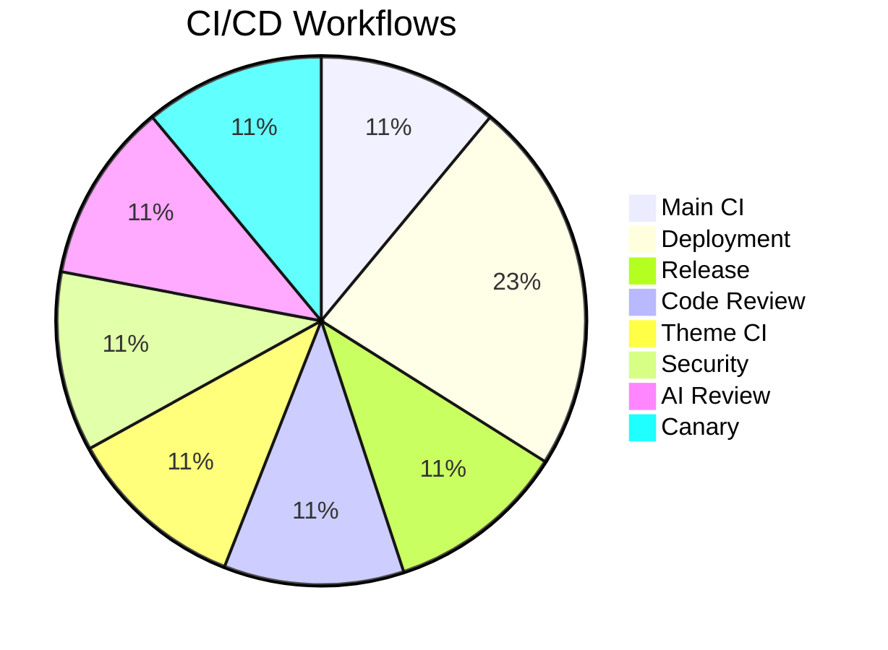
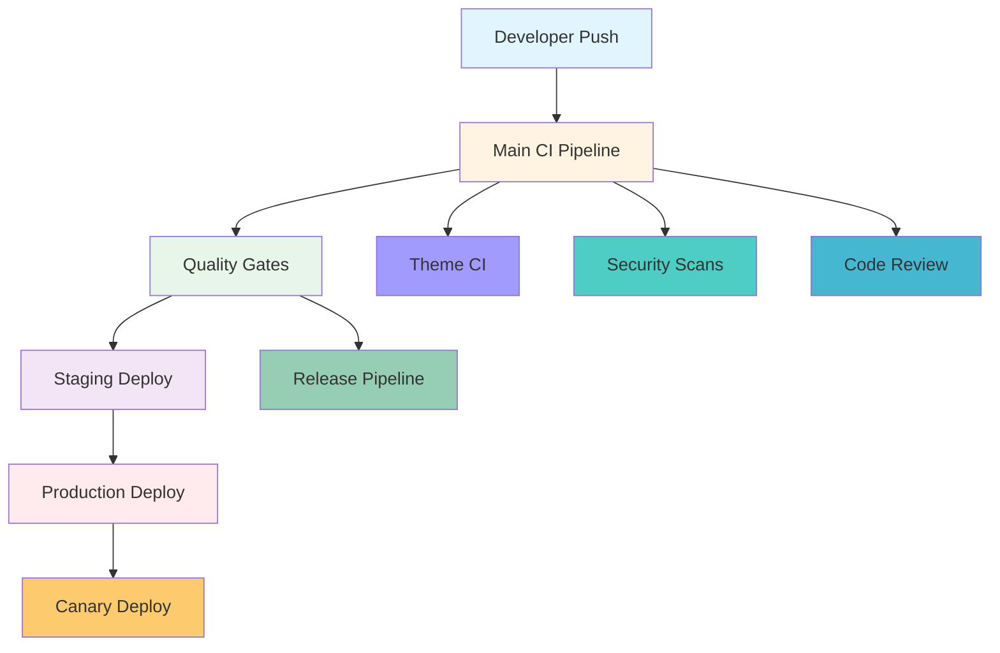
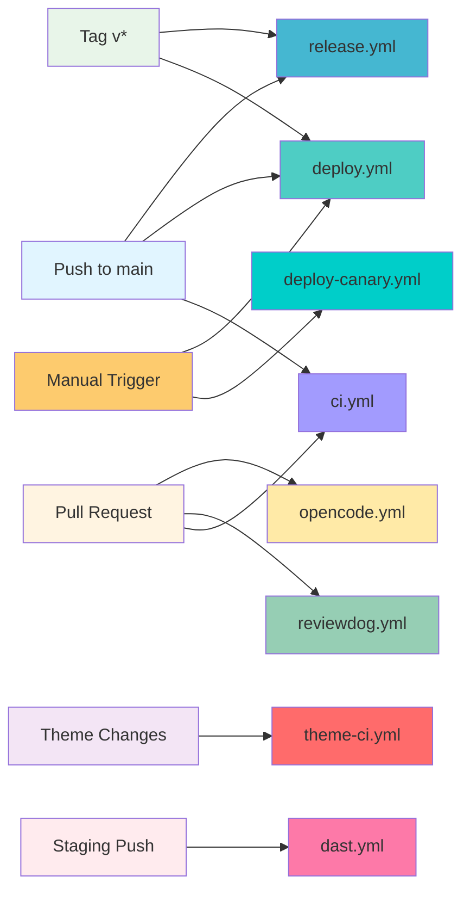
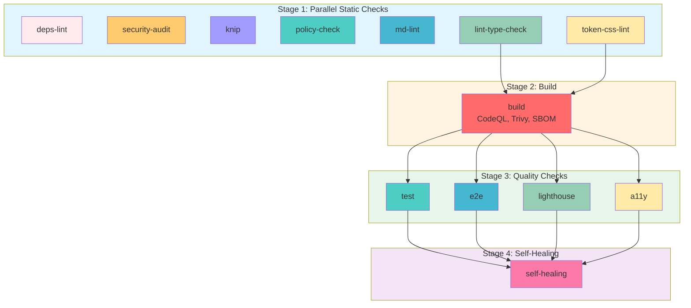
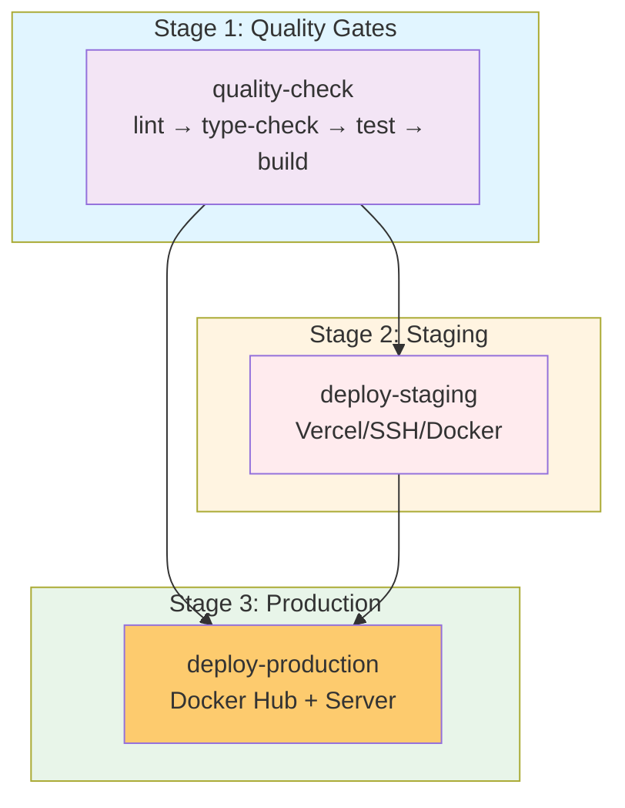
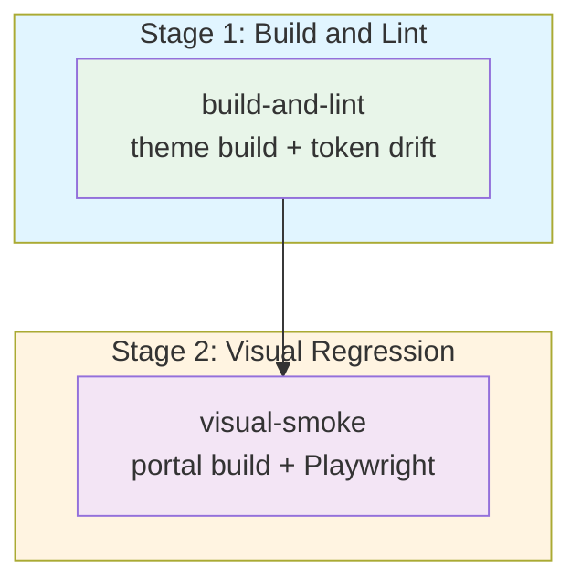
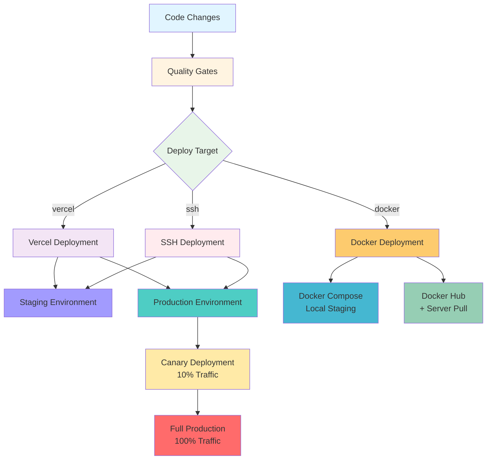
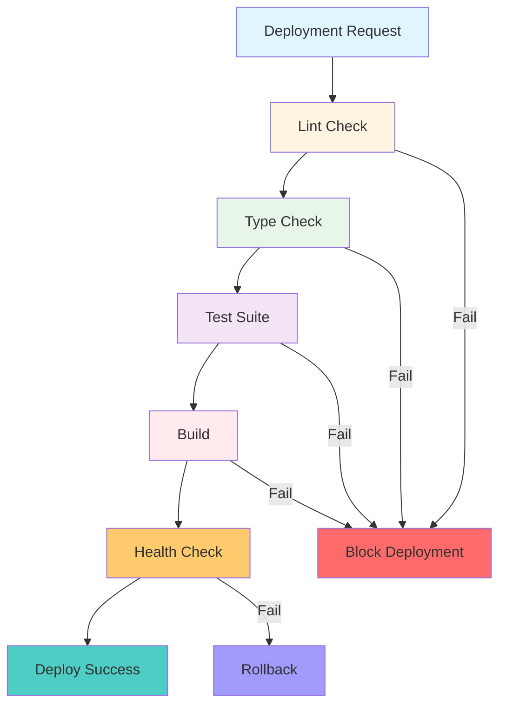

# CI/CD Pipeline Map

**Generated:** 2026-08-18  
**System:** Arch-System Mining Operations Portal

## Overview

This map details the complete CI/CD pipeline architecture, including workflow stages, jobs, deployment strategies, and environments.

## Visual Overview

### Workflow Distribution

### CI/CD Pipeline Overview

### Trigger Flow

---

## 1. Workflow Files and Purposes

| Workflow File         | Trigger                                            | Purpose                                                        |
| --------------------- | -------------------------------------------------- | -------------------------------------------------------------- |
| **ci.yml**            | Push to main/master, PR to main/master             | Main CI pipeline with comprehensive quality gates              |
| **deploy.yml**        | Push to main/master, tags (v\*), workflow_dispatch | Deployment to staging and production environments              |
| **deploy-canary.yml** | Workflow_dispatch                                  | Canary deployment to production with 10% traffic split         |
| **release.yml**       | Push to main                                       | Automated versioning and publishing via Changesets             |
| **reviewdog.yml**     | Pull requests                                      | Code review with ESLint, Prettier, and Markdown linting        |
| **theme-ci.yml**      | Changes to packages/theme/\*\*                     | Theme-specific build, token drift, and visual regression tests |
| **dast.yml**          | Push to staging, daily cron                        | Dynamic Application Security Testing (OWASP ZAP)               |
| **opencode.yml**      | PR comments with /oc or /opencode                  | AI-powered code review via OpenCode                            |

---

## 2. Pipeline Stages and Order

### Main CI Pipeline (ci.yml)

### Deployment Pipeline (deploy.yml)

### Theme CI Pipeline (theme-ci.yml)

---

## 3. Key Jobs and Responsibilities

### ci.yml Jobs

| Job                 | Responsibility                                           | Tools/Commands                                |
| ------------------- | -------------------------------------------------------- | --------------------------------------------- |
| **deps-lint**       | Ensures dependency version consistency across monorepo   | `pnpm deps:lint` (syncpack)                   |
| **security-audit**  | Security vulnerability scanning + secret detection       | `pnpm audit --audit-level=high`, gitleaks     |
| **knip**            | Dead code and unused dependency detection                | `pnpm knip`                                   |
| **policy-check**    | Policy compliance validation                             | `pnpm policy:check`                           |
| **md-lint**         | Markdown linting                                         | `pnpm md:lint`                                |
| **lint-type-check** | ESLint and TypeScript type checking                      | `pnpm nx affected -t lint type-check`         |
| **token-css-lint**  | Design token and CSS linting                             | `pnpm nx affected -t lint:tokens lint:css`    |
| **build**           | Build with CodeQL, Trivy, SBOM, DeepEval, Terraform lint | CodeQL, Trivy, Anchore SBOM, DeepEval, tflint |
| **test**            | Unit tests with coverage reporting                       | `pnpm nx affected -t test -- --coverage`      |
| **e2e**             | End-to-end tests with Playwright                         | `pnpm test:e2e`                               |
| **lighthouse**      | Performance, SEO, and best practices audit               | `@lhci/cli autorun`                           |
| **a11y**            | Accessibility audit via Storybook                        | `pnpm test:a11y` against Storybook            |
| **self-healing**    | Auto-fix CI issues using Nx                              | `pnpm exec nx fix-ci`                         |

### deploy.yml Jobs

| Job                   | Responsibility                                              | Deployment Targets                                                 |
| --------------------- | ----------------------------------------------------------- | ------------------------------------------------------------------ |
| **quality-check**     | Pre-deployment quality gate (lint, type-check, test, build) | Runs all checks before deployment                                  |
| **deploy-staging**    | Deploy to staging environment                               | Vercel, SSH, or Docker Compose (controlled by `DEPLOY_TARGET` var) |
| **deploy-production** | Deploy to production environment                            | Vercel, SSH, or Docker Hub + server pull                           |

### Other Workflows

| Workflow              | Job            | Responsibility                                                       |
| --------------------- | -------------- | -------------------------------------------------------------------- |
| **theme-ci.yml**      | build-and-lint | Theme build, token drift verification, uncommitted changes check     |
| **theme-ci.yml**      | visual-smoke   | Visual regression tests against theme changes                        |
| **reviewdog.yml**     | reviewdog      | PR-focused linting (ESLint, Prettier, Markdown) with inline comments |
| **dast.yml**          | dast           | OWASP ZAP baseline scan against staging                              |
| **release.yml**       | release        | Changesets versioning and publishing                                 |
| **deploy-canary.yml** | canary_deploy  | Canary deployment with 10% traffic, smoke tests, metrics monitoring  |
| **opencode.yml**      | opencode       | AI code review on PR comment trigger                                 |

---

## 4. Deployment Strategies and Environments

### Environments

| Environment    | Trigger                                                      | URL                                 | Purpose                            |
| -------------- | ------------------------------------------------------------ | ----------------------------------- | ---------------------------------- |
| **Staging**    | Push to main/master, workflow_dispatch (environment=staging) | `STAGING_URL` var or localhost:8080 | Pre-production testing, DAST scans |
| **Production** | Tags (v\*), workflow_dispatch (environment=production)       | `PRODUCTION_URL` var                | Live production deployment         |
| **Canary**     | Manual workflow_dispatch                                     | Simulated canary endpoint           | Gradual rollout (10% → 100%)       |

### Deployment Strategies

#### Deployment Strategy Overview

#### 1. Vercel Deployment

- Controlled by `DEPLOY_TARGET=vercel` variable
- Staging: `vercel --target=staging`
- Production: `vercel --prod`
- Requires: `VERCEL_TOKEN`, `VERCEL_ORG_ID`, `VERCEL_PROJECT_ID`

#### 2. SSH/On-Premises Deployment

- Controlled by `DEPLOY_TARGET=ssh` variable
- Git pull + `./scripts/deploy.sh staging|production --force`
- Requires: `DEPLOY_HOST`, `DEPLOY_USER`, `DEPLOY_KEY`

#### 3. Docker/Container Deployment

- Controlled by `DEPLOY_TARGET=docker` variable
- **Staging**: Local Docker Compose stack (`./scripts/staging-local.sh`) with reverse proxy simulation
- **Production**: Build → push to Docker Hub → server pull + compose up
- Requires: `DOCKER_USERNAME`, `DOCKER_PASSWORD`, build args for env vars

#### 4. Canary Deployment

- Manual trigger via workflow_dispatch
- Simulated 10% traffic split (commented Argo Rollouts/Istio commands)
- Smoke tests against canary endpoint
- 5-minute metrics monitoring (Prometheus)
- Auto-promotion to 100% if stable

### Deployment Safety Features

#### Quality Gates Flow

- **Concurrency control**: CI cancels in-progress runs; deploy prevents concurrent deploys per environment
- **Quality gates**: Lint → type-check → test → build must pass before deployment
- **Health checks**: Curl-based health checks after deployment
- **Rollback capability**: Canary workflow includes rollback trigger
- **Notifications**: Webhook notification on production deployment status
- **Environment protection**: GitHub environments with required checks (implied by environment syntax)

---

## 5. Key Configuration Details

### Node/pnpm versions

- Node 22, pnpm 9.15.9 (consistent across all workflows)

### CI Environment Variables (dummy values for builds)

- `NEXT_PUBLIC_SUPABASE_URL`, `SUPABASE_URL`, `SUPABASE_ANON_KEY`, `SUPABASE_SERVICE_KEY`
- `DATABASE_URL`, `N8N_URL`, `FLOWISE_URL`, `PAYLOAD_SECRET`
- `NEXT_TELEMETRY_DISABLED=1`

### Nx Affected Commands

Most jobs use `pnpm nx affected -t <target>` to only run on changed packages, optimizing CI time.

### Artifact Retention

- Coverage reports (14 days)
- Lighthouse reports (14 days)
- Playwright screenshots (on failure)

### Security Scanning

Multi-layered security scanning:

- npm audit (dependency vulnerabilities)
- gitleaks (SAST - secret detection)
- Trivy (container security)
- OWASP ZAP (DAST - dynamic application security testing)
- CodeQL (SAST - code analysis)

---

## 6. Quality Gates

### Pre-Commit

- Husky pre-commit hooks
- Lint-staged for staged files
- ESLint, Prettier, TypeScript checks

### Pre-Push

- `pnpm quality` command runs:
  - lint → type-check → test → lint:tokens → lint:css → lint:root → lint:styles → format:check → deps:lint → knip → policy:check → audit:rls → audit:design

### CI Pipeline

- All static checks must pass
- Build must succeed
- Tests must pass with coverage
- E2E tests must pass
- Performance audits (Lighthouse)
- Accessibility audits (a11y)
- Security scans (npm audit, gitleaks, Trivy, CodeQL)

### Pre-Deployment

- All CI checks must pass
- Quality gate job runs full lint → type-check → test → build
- Health checks after deployment

---

## 7. Monitoring & Observability

### Build Monitoring

- Nx Cloud for distributed caching
- Build time tracking
- Failure notifications

### Deployment Monitoring

- Health check endpoints
- Prometheus metrics
- Rollback capabilities
- Canary traffic monitoring

### Security Monitoring

- Secret detection (gitleaks)
- Dependency vulnerabilities (npm audit)
- Container vulnerabilities (Trivy)
- DAST scans (OWASP ZAP)

---

## 8. Self-Healing

### Nx fix-ci

- Automatically fixes common CI issues
- Runs after all jobs complete
- Can fix dependency issues, linting errors, etc.
- Commit changes if successful

---

## Summary

The CI/CD pipeline features:

- **8 workflow files** covering CI, deployment, release, code review, theme, security, and AI review
- **Multi-stage pipeline** with parallel execution for efficiency
- **Comprehensive quality gates** including linting, type-checking, testing, security scanning, and performance audits
- **Multiple deployment strategies** (Vercel, SSH, Docker) with environment-specific configurations
- **Canary deployment** support with gradual rollout and rollback capabilities
- **Nx affected commands** for optimized CI execution on changed packages only
- **Multi-layered security scanning** (SAST, DAST, dependency, container)
- **Self-healing capabilities** via Nx fix-ci
- **Theme-specific CI** with visual regression testing
- **AI-powered code review** via OpenCode integration
