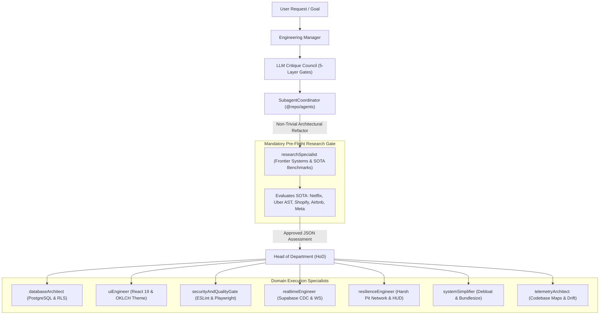

# 🤖 Multi-Agent Architecture & Pre-Flight Research Gate Map

**Generated:** 9/2/2026, 11:13:16 AM UTC  
**Package:** `@repo/agents`  
**Orchestration:** Multi-Agent Specialist Hierarchy + Langfuse Tracing

---

## 🏛️ Autonomous Specialist Persona Roster

---

## 🔬 Architectural Pre-Flight Research Gate Mandate
- **Rule Source**: Codified in `docs/GEMINI.md` and `docs/AGENTS.md`.
- **Implementation**: `SubagentCoordinator.evaluateArchitecturalPreFlight(proposal, scope)`.
- **Benchmark Evaluation Surface**:
  - **Airbnb / PayPal**: Semantic Data Contracts (Zero database-to-contract drift).
  - **Netflix / ThoughtWorks**: Architecture-as-Code Fitness Functions (Drift Health Index $ge 90\%$).
  - **Uber / Sourcegraph**: AST Codebase Maps & Topology Graphs.
  - **Meta / Google**: Perceptual visual diffing & synthetic navigation canaries.
