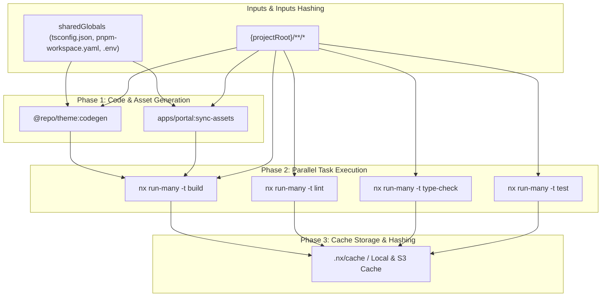
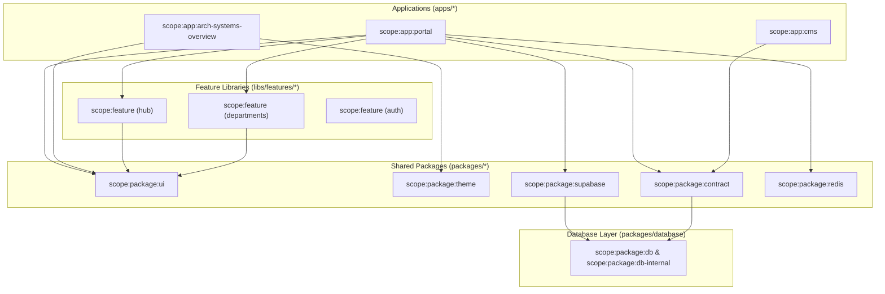

# ⚡ Nx 22 Project Graph & Task Pipeline Map

**Generated:** 8/24/2026, 8:12:37 AM UTC  
**Orchestration Engine:** Nx 22.7.5 + pnpm Workspaces

---

## 🎨 Visual Nx Task Execution Pipeline

---

## 🏷️ Nx Scope Tagging Hierarchy

---

## ⚙️ Nx Configuration Overview (`nx.json`)

- **Default Base**: `master`
- **Task Hashing**: Inputs hash includes `sharedGlobals` + project files
- **Caching**: `build`, `lint`, `type-check`, `test`, `codegen` set to `cache: true`
- **Boundary Rules**: Enforces zero illegal imports from UI to Database internals
