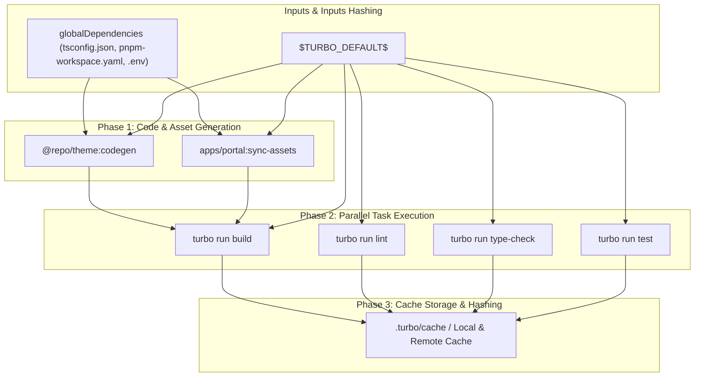
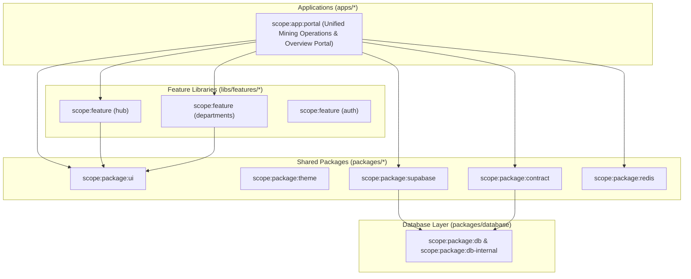

# ⚡ Turborepo Project Graph & Task Pipeline Map

**Generated:** ${dateInfo.displayDate}  
**Orchestration Engine:** Turborepo 2.x + pnpm Workspaces

---

## 🎨 Visual Turborepo Task Execution Pipeline

---

## 🏷️ Nx Scope Tagging Hierarchy

---

## ⚙️ Turborepo Configuration Overview (`turbo.json`)

- **Task Pipelines**: `build`, `lint`, `type-check`, `test`, `codegen`, `sync-assets`
- **Task Hashing**: Inputs hash includes `globalDependencies`, `globalEnv`, and `$TURBO_DEFAULT$`
- **Caching**: `build`, `lint`, `type-check`, `test`, `codegen` set to `cache: true`
- **Boundary Rules**: Enforces zero illegal imports from UI to Database internals via `eslint-plugin-boundaries`
