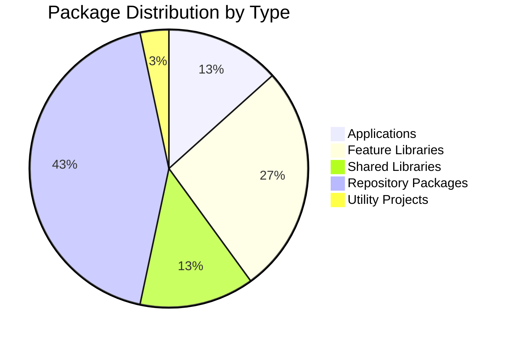
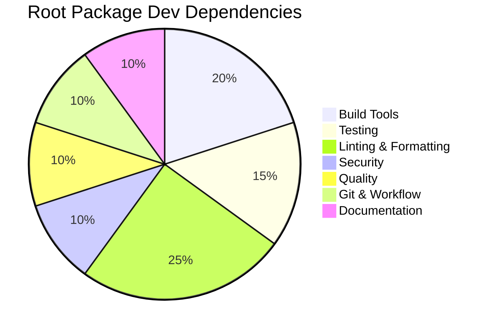
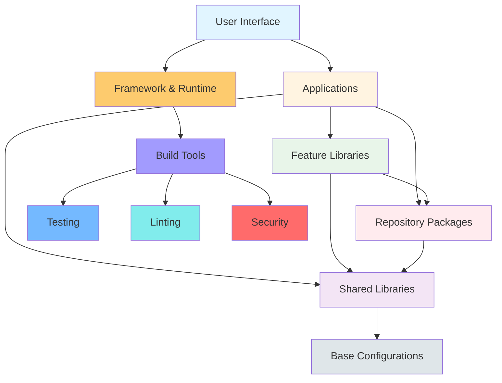
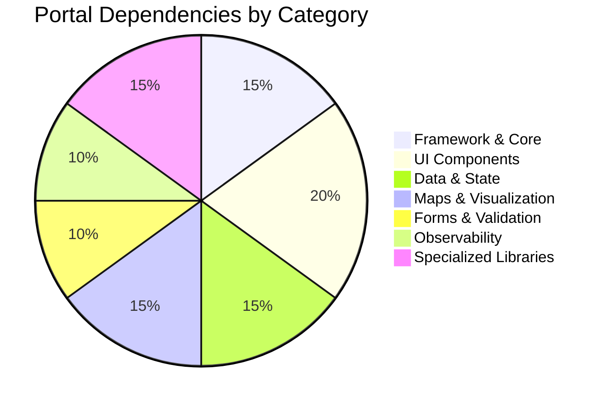
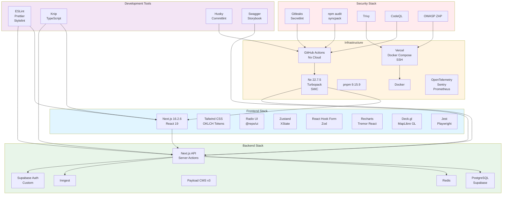

# Package Structure Map

**Generated:** 2026-08-18  
**System:** Arch-System Mining Operations Portal

## Overview

This map details the package structure, dependencies, and key technologies across the monorepo.

## Visual Overview

### Package Distribution by Type

### Root Package Dependency Categories

### Technology Stack Layers

## Root Configuration

### package.json

- **Name:** arch-systems
- **Version:** 1.5.1
- **Package Manager:** pnpm@9.15.9
- **Node Version:** >=22 (Volta: 24.15.0)
- **Type:** ESM (type: module)
- **License:** MIT

### Key Dev Dependencies

- **Build Tools:** Nx 22.7.5, Vite 8.0.16, SWC 1.15.40
- **Testing:** Jest 30.0.0, Playwright 1.60.0, Storybook 8.6.14
- **Linting:** ESLint, Prettier, Stylelint 17.11.1, CSpell, Markdownlint
- **Security:** Secretlint 13.0.2, Gitleaks (via CI)
- **Quality:** Knip 5.45.0 (dead code), Syncpack 13.0.4 (dependency consistency)
- **Git:** Husky 9.1.7, Commitlint 21.0.1, Lint-staged 17.0.7
- **Documentation:** Swagger-jsdoc 6.3.0

### Security Overrides

Extensive security overrides for vulnerable packages:

- handlebars, brace-expansion, minimatch, braces, glob
- serialize-javascript, kysely, tmp, uuid, smol-toml
- esbuild, @babel/runtime, js-yaml

## Applications (4)

### 1. portal (apps/portal)

**Purpose:** Main mining operations portal (Next.js 15+)

**Key Dependencies:**

- **Framework:** Next.js 16.2.6, React 19 (catalog:react19)
- **UI Components:** @repo/ui, @repo/theme, Radix UI, Tremor React
- **Data:** @repo/supabase, @repo/redis, @repo/contract
- **Maps:** @deck.gl, maplibre-gl, react-map-gl
- **Forms:** react-hook-form, @hookform/resolvers, zod
- **State:** zustand, xstate
- **Charts:** recharts
- **PDF:** @react-pdf/renderer
- **QR Codes:** qr-code-styling
- **Spreadsheets:** @univerjs/presets
- **Observability:** OpenTelemetry, @sentry/nextjs, prom-client
- **PWA:** @ducanh2912/next-pwa
- **Background:** lenis (smooth scrolling)
- **API Documentation:** next-swagger-doc, swagger-ui-react
- **Workflow:** inngest
- **Security:** bcryptjs, @repo/rate-limiter

**Portal Dependency Breakdown:**

**Scripts:**

- `dev`: Turbopack dev server
- `build`: Generate OpenAPI spec + Next.js build
- `test`: Jest with 50% max workers
- `generate-openapi-spec`: API documentation generation

### 2. cms (apps/cms)

**Purpose:** Payload CMS v3 content management system

**Key Dependencies:**

- **Framework:** Next.js 16.2.6, React 19
- **CMS:** Payload 3.84.1, @payloadcms/next, @payloadcms/db-postgres
- **Rich Text:** @payloadcms/richtext-lexical

**Scripts:**

- `dev`: Next.js dev server
- `payload`: Payload CLI
- `build`: Next.js build

### 3. arch-systems-overview (apps/overview)

**Purpose:** Overview dashboard application

**Dependencies:** @repo/theme

### 4. n8n-mcp-server (tools/n8n-mcp)

**Purpose:** n8n MCP server integration

**Dependencies:** None (standalone)

## Feature Libraries (8)

### Data Access Layer (3)

#### features-departments-data-access (@repo/departments/data-access)

- **Scope:** departments, data-access, feature
- **Purpose:** Department-specific data access
- **Dependencies:** None

#### features-analytics-data-access (@repo/analytics/data-access)

- **Scope:** analytics, data-access, feature
- **Purpose:** Analytics data access
- **Dependencies:** None

#### features-dashboard-data-access (@repo/dashboard/data-access)

- **Scope:** dashboard, data-access, feature
- **Purpose:** Dashboard data access
- **Dependencies:** @repo/supabase, @repo/redis, @repo/errors, @repo/logger

### UI Layer (4)

#### features-departments-ui

- **Scope:** departments, ui, feature
- **Purpose:** Department UI components
- **Dependencies:** @repo/contract, @repo/errors, @repo/logger, @repo/redis, @repo/supabase, @repo/ui, @repo/utils, shared-hooks, shared-data-access

#### features-auth-ui

- **Scope:** auth, ui, feature
- **Purpose:** Authentication UI components
- **Dependencies:** @repo/ui, features-auth-data-access, features-auth-utils

#### features-hub-ui

- **Scope:** hub, ui, feature
- **Purpose:** Hub UI components
- **Dependencies:** @repo/ui, features-departments-data-access

#### features-access-control-ui

- **Scope:** access-control, ui, feature
- **Purpose:** Access control UI components
- **Dependencies:** None

### Utilities (1)

#### features-auth-utils

- **Scope:** auth, utils, feature
- **Purpose:** Authentication utilities
- **Dependencies:** None

#### features-auth-data-access

- **Scope:** auth, data-access, feature
- **Purpose:** Authentication data access
- **Dependencies:** None

## Shared Libraries (4)

### shared-data-access

- **Purpose:** Shared data access patterns
- **Dependencies:** @repo/supabase, @repo/redis, @repo/errors

### shared-hooks

- **Purpose:** Shared React hooks
- **Dependencies:** None

### shared-styles

- **Purpose:** Shared styles and CSS
- **Dependencies:** None

### shared-utils

- **Purpose:** Shared utility functions
- **Dependencies:** @repo/redis, @repo/errors

## Repository Packages (13)

### @repo/contract

- **Purpose:** Shared contracts, schemas, and validation
- **Dependencies:** @repo/typescript-config

### @repo/database

- **Purpose:** Database migrations and schema management
- **Dependencies:** None

### @repo/supabase

- **Purpose:** Supabase client and server utilities
- **Dependencies:** None

### @repo/ui

- **Purpose:** Shared UI component library
- **Dependencies:** @repo/typescript-config, @repo/theme

### @repo/theme

- **Purpose:** Design system, tokens, and styling
- **Dependencies:** @repo/typescript-config

### @repo/typescript-config

- **Purpose:** TypeScript configuration
- **Dependencies:** None

### @repo/eslint-config

- **Purpose:** ESLint configuration
- **Dependencies:** None

### @repo/logger

- **Purpose:** Logging utilities
- **Dependencies:** @repo/typescript-config

### @repo/errors

- **Purpose:** Error handling utilities
- **Dependencies:** None

### @repo/redis

- **Purpose:** Redis client and utilities
- **Dependencies:** @repo/typescript-config

### @repo/utils

- **Purpose:** General utility functions
- **Dependencies:** @repo/typescript-config

### @repo/rate-limiter

- **Purpose:** Rate limiting utilities
- **Dependencies:** @repo/typescript-config

### @repo/agents

- **Purpose:** Agent-related utilities
- **Dependencies:** @repo/typescript-config

### @repo/eval

- **Purpose:** Evaluation utilities
- **Dependencies:** None

### @repo/cloudflare-workflows

- **Purpose:** Cloudflare Workflows integration
- **Dependencies:** None

## Utility Projects (1)

### scripts-seeds (scripts/seeds)

- **Purpose:** Database seeding scripts
- **Dependencies:** None

## Technology Stack Summary

### Technology Stack Architecture

### Frontend

- **Framework:** Next.js 16.2.6 (App Router), React 19
- **Styling:** Tailwind CSS, custom design tokens (OKLCH)
- **UI Components:** Radix UI, custom @repo/ui
- **State Management:** Zustand, XState
- **Forms:** React Hook Form, Zod validation
- **Charts:** Recharts, Tremor React
- **Maps:** Deck.gl, MapLibre GL
- **Spreadsheets:** Univer.js
- **PWA:** next-pwa
- **Testing:** Jest, Playwright, Testing Library

### Backend

- **Database:** PostgreSQL via Supabase
- **Cache:** Redis
- **CMS:** Payload CMS v3
- **API:** Next.js API routes, Server Actions
- **Workflows:** Inngest
- **Auth:** Supabase Auth + custom implementation

### Infrastructure

- **Build:** Nx 22.7.5, Turbopack, SWC
- **Package Manager:** pnpm 9.15.9
- **Container:** Docker
- **Observability:** OpenTelemetry, Sentry, Prometheus
- **CI/CD:** GitHub Actions, Nx Cloud
- **Deployment:** Vercel, Docker Compose, SSH

### Security

- **Secret Scanning:** Gitleaks, Secretlint
- **Dependency Auditing:** npm audit, syncpack
- **Container Security:** Trivy
- **SAST:** CodeQL
- **DAST:** OWASP ZAP

### Development

- **Linting:** ESLint, Prettier, Stylelint, CSpell, Markdownlint
- **Code Quality:** Knip (dead code), TypeScript strict mode
- **Git:** Husky, Commitlint, Lint-staged
- **Documentation:** Swagger/OpenAPI, Storybook

## Catalog Dependencies

The project uses pnpm catalog dependencies for consistent versioning:

- `catalog:` - Common dependencies managed centrally
- `catalog:react19` - React 19 specific versions
- `catalog:` packages include: eslint, prettier, typescript, tailwindcss, react-hook-form, recharts, sonner, zustand, xstate, zod, lucide-react, lenis, @sentry/nextjs, @tremor/react, supabase

## Dependency Patterns

### Minimal Dependencies

- Feature data-access layers have no dependencies (clean architecture)
- CMS has minimal dependencies (TypeScript config only)
- Shared libraries have focused, minimal dependency trees

### Shared Infrastructure

- All @repo/\* packages depend on @repo/typescript-config
- Data-access layers depend on @repo/supabase, @repo/redis, @repo/errors, @repo/logger
- UI layers depend on @repo/ui and @repo/theme

### Portal Complexity

- Portal is the most complex application with 15+ dependencies
- Integrates observability (OpenTelemetry, Sentry, Prometheus)
- Includes specialized libraries (maps, spreadsheets, PDF, QR codes)
