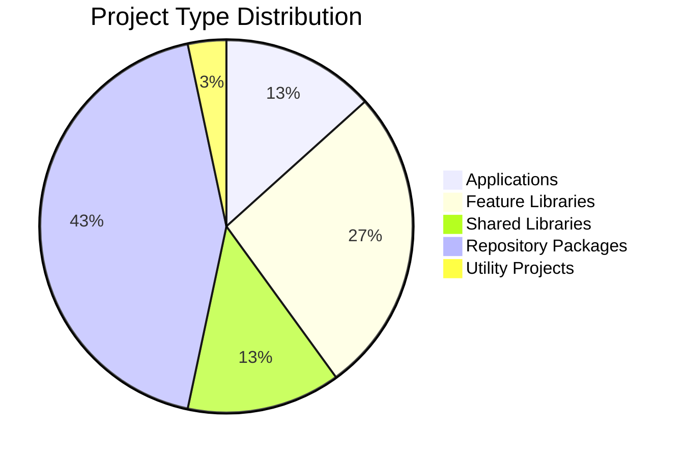
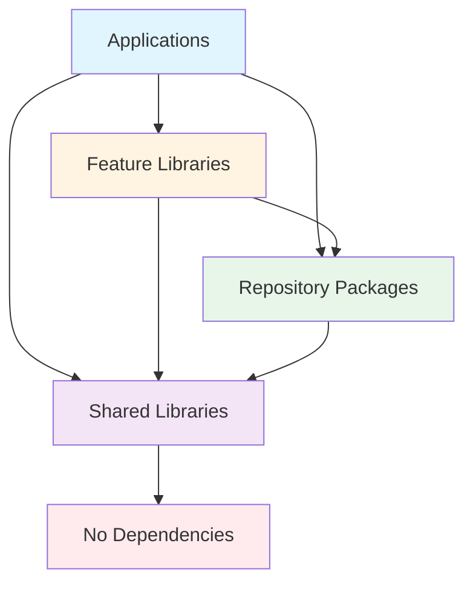
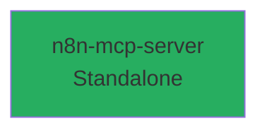
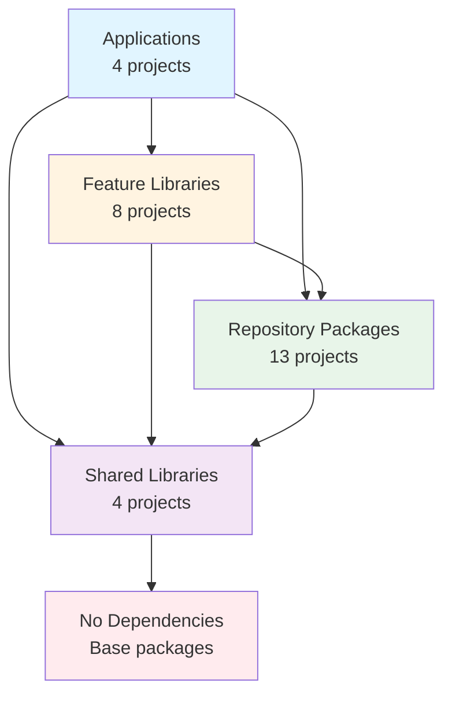
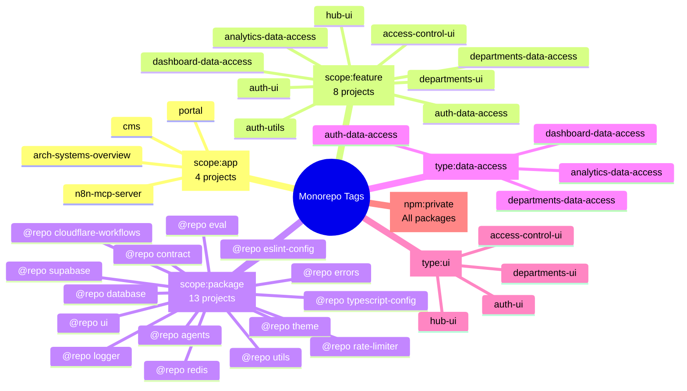
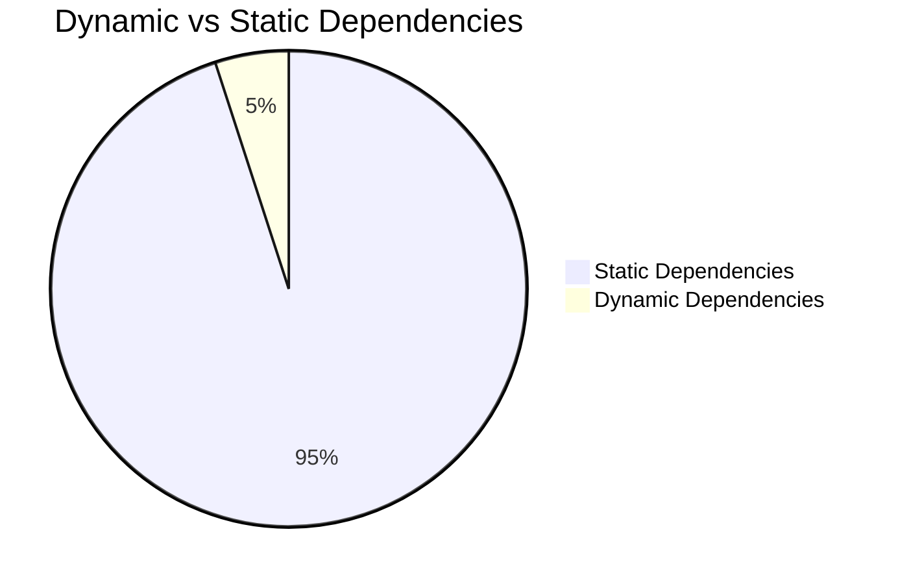

# Project Dependencies Map

**Generated:** 2026-08-18  
**System:** Arch-System Mining Operations Portal

## Overview

This map visualizes the dependency relationships between all projects in the Nx monorepo workspace.

## Visual Overview

### Project Type Distribution



### Dependency Count by Project Type

```mermaid
bar title Average Dependencies by Project Type
    "Applications" : 4
    "Feature Libraries" : 2
    "Shared Libraries" : 2
    "Repository Packages" : 0
    "Utility Projects" : 0
```

### High-Level Dependency Flow



## Applications (3)

### portal

- **Type:** Application (Next.js 15+)
- **Port:** 3000
- **Purpose:** Main mining operations portal
- **Dependencies:** 15 packages (most complex)

```mermaid
graph TD
    PORTAL[portal<br/>Next.js App] --> SUPABASE[@repo/supabase]
    PORTAL --> UI[@repo/ui<br/>dynamic]
    PORTAL --> CONTRACT[@repo/contract]
    PORTAL --> UTILS[@repo/utils<br/>dynamic]
    PORTAL --> DEPT_DA[features-departments-data-access]
    PORTAL --> DEPT_UI[features-departments-ui]
    PORTAL --> REDIS[@repo/redis]
    PORTAL --> RATE[@repo/rate-limiter]
    PORTAL --> LOGGER[@repo/logger]
    PORTAL --> THEME[@repo/theme]
    PORTAL --> AUTH_UI[features-auth-ui]
    PORTAL --> HUB_UI[features-hub-ui]
    PORTAL --> SHARED_DA[shared-data-access]
    PORTAL --> SHARED_UTILS[shared-utils]
    PORTAL --> TS_CONFIG[@repo/typescript-config]
    PORTAL --> ERRORS[@repo/errors]

    UI --> THEME
    UI --> TS_CONFIG
    DEPT_UI --> CONTRACT
    DEPT_UI --> ERRORS
    DEPT_UI --> LOGGER
    DEPT_UI --> REDIS
    DEPT_UI --> SUPABASE
    DEPT_UI --> UI
    DEPT_UI --> UTILS
    DEPT_UI --> SHARED_HOOKS[shared-hooks]
    DEPT_UI --> SHARED_DA

    AUTH_UI --> UI
    AUTH_UI --> AUTH_DA[features-auth-data-access]
    AUTH_UI --> AUTH_UTILS[features-auth-utils]

    HUB_UI --> UI
    HUB_UI --> DEPT_DA

    SHARED_DA --> SUPABASE
    SHARED_DA --> REDIS
    SHARED_DA --> ERRORS

    SHARED_UTILS --> REDIS
    SHARED_UTILS --> ERRORS

    RATE --> TS_CONFIG
    LOGGER --> TS_CONFIG
    REDIS --> TS_CONFIG
    THEME --> TS_CONFIG
    UTILS --> TS_CONFIG

    style PORTAL fill:#ff6b6b
    style SUPABASE fill:#4ecdc4
    style UI fill:#45b7d1
    style CONTRACT fill:#96ceb4
    style UTILS fill:#ffeaa7
    style DEPT_DA fill:#dfe6e9
    style DEPT_UI fill:#fdcb6e
    style REDIS fill:#e17055
    style RATE fill:#00b894
    style LOGGER fill:#6c5ce7
    style THEME fill:#fd79a8
    style AUTH_UI fill:#a29bfe
    style HUB_UI fill:#00cec9
    style SHARED_DA fill:#81ecec
    style SHARED_UTILS fill:#74b9ff
    style TS_CONFIG fill:#b2bec3
    style ERRORS fill:#fab1a0
```

### cms

- **Type:** Application (Payload CMS v3)
- **Purpose:** Content management system
- **Dependencies:** 1 package (minimal)

```mermaid
graph LR
    CMS[cms<br/>Payload CMS] --> TS_CONFIG[@repo/typescript-config]

    style CMS fill:#9b59b6
    style TS_CONFIG fill:#b2bec3
```

### arch-systems-overview

- **Type:** Application
- **Purpose:** Overview dashboard
- **Dependencies:** 1 package

```mermaid
graph LR
    OVERVIEW[arch-systems-overview] --> THEME[@repo/theme]
    THEME --> TS_CONFIG[@repo/typescript-config]

    style OVERVIEW fill:#e67e22
    style THEME fill:#fd79a8
    style TS_CONFIG fill:#b2bec3
```

### n8n-mcp-server

- **Type:** Application
- **Purpose:** n8n MCP server integration
- **Dependencies:** None (standalone)



## Feature Libraries (8)

### Feature Library Dependency Map

```mermaid
graph TD
    DEPT_DA[features-departments-data-access<br/>No deps]
    ANALYTICS_DA[features-analytics-data-access<br/>No deps]
    DASHBOARD_DA[features-dashboard-data-access]
    ACCESS_UI[features-access-control-ui<br/>No deps]
    AUTH_DA[features-auth-data-access<br/>No deps]
    DEPT_UI[features-departments-ui]
    AUTH_UI[features-auth-ui]
    AUTH_UTILS[features-auth-utils<br/>No deps]
    HUB_UI[features-hub-ui]

    DASHBOARD_DA --> SUPABASE[@repo/supabase]
    DASHBOARD_DA --> REDIS[@repo/redis]
    DASHBOARD_DA --> ERRORS[@repo/errors]
    DASHBOARD_DA --> LOGGER[@repo/logger]

    DEPT_UI --> CONTRACT[@repo/contract]
    DEPT_UI --> ERRORS
    DEPT_UI --> LOGGER
    DEPT_UI --> REDIS
    DEPT_UI --> SUPABASE
    DEPT_UI --> UI[@repo/ui]
    DEPT_UI --> UTILS[@repo/utils]
    DEPT_UI --> HOOKS[shared-hooks]
    DEPT_UI --> SHARED_DA[shared-data-access]

    AUTH_UI --> UI
    AUTH_UI --> AUTH_DA
    AUTH_UI --> AUTH_UTILS

    HUB_UI --> UI
    HUB_UI --> DEPT_DA

    SHARED_DA --> SUPABASE
    SHARED_DA --> REDIS
    SHARED_DA --> ERRORS

    UI --> THEME[@repo/theme]
    UI --> TS_CONFIG[@repo/typescript-config]

    UTILS --> TS_CONFIG
    REDIS --> TS_CONFIG
    LOGGER --> TS_CONFIG
    THEME --> TS_CONFIG
    CONTRACT --> TS_CONFIG

    style DEPT_DA fill:#dfe6e9
    style ANALYTICS_DA fill:#dfe6e9
    style DASHBOARD_DA fill:#fdcb6e
    style ACCESS_UI fill:#dfe6e9
    style AUTH_DA fill:#dfe6e9
    style DEPT_UI fill:#fd79a8
    style AUTH_UI fill:#a29bfe
    style AUTH_UTILS fill:#dfe6e9
    style HUB_UI fill:#00cec9
```

### features-departments-data-access

- **Package:** @repo/departments/data-access
- **Scope:** departments, data-access, feature
- **Dependencies:** None

### features-analytics-data-access

- **Package:** @repo/analytics/data-access
- **Scope:** analytics, data-access, feature
- **Dependencies:** None

### features-dashboard-data-access

- **Package:** @repo/dashboard/data-access
- **Scope:** dashboard, data-access, feature
- **Dependencies:**
  - @repo/supabase (static)
  - @repo/redis (static)
  - @repo/errors (static)
  - @repo/logger (static)

### features-access-control-ui

- **Scope:** access-control, ui, feature
- **Dependencies:** None

### features-auth-data-access

- **Scope:** auth, data-access, feature
- **Dependencies:** None

### features-departments-ui

- **Scope:** departments, ui, feature
- **Dependencies:**
  - @repo/contract (static)
  - @repo/errors (static)
  - @repo/logger (static)
  - @repo/redis (static)
  - @repo/supabase (static)
  - @repo/ui (static)
  - @repo/utils (static, dynamic)
  - shared-hooks (static)
  - shared-data-access (static)

### features-auth-ui

- **Scope:** auth, ui, feature
- **Dependencies:**
  - @repo/ui (static)
  - features-auth-data-access (static)
  - features-auth-utils (static)

### features-auth-utils

- **Scope:** auth, utils, feature
- **Dependencies:** None

### features-hub-ui

- **Scope:** hub, ui, feature
- **Dependencies:**
  - @repo/ui (static)
  - features-departments-data-access (static)

## Shared Libraries (4)

### Shared Libraries Dependency Map

```mermaid
graph TD
    SHARED_DA[shared-data-access]
    SHARED_HOOKS[shared-hooks<br/>No deps]
    SHARED_STYLES[shared-styles<br/>No deps]
    SHARED_UTILS[shared-utils]

    SHARED_DA --> SUPABASE[@repo/supabase]
    SHARED_DA --> REDIS[@repo/redis]
    SHARED_DA --> ERRORS[@repo/errors]

    SHARED_UTILS --> REDIS
    SHARED_UTILS --> ERRORS

    style SHARED_DA fill:#81ecec
    style SHARED_HOOKS fill:#dfe6e9
    style SHARED_STYLES fill:#dfe6e9
    style SHARED_UTILS fill:#74b9ff
```

### shared-data-access

- **Dependencies:**
  - @repo/supabase (static)
  - @repo/redis (static)
  - @repo/errors (static)

### shared-hooks

- **Dependencies:** None

### shared-styles

- **Dependencies:** None

### shared-utils

- **Dependencies:**
  - @repo/redis (static)
  - @repo/errors (static)

## Repository Packages (13)

### Repository Packages Dependency Map

```mermaid
graph TD
    CONTRACT[@repo/contract]
    DATABASE[@repo/database<br/>No deps]
    SUPABASE[@repo/supabase<br/>No deps]
    UI[@repo/ui]
    THEME[@repo/theme]
    TS_CONFIG[@repo/typescript-config<br/>No deps]
    ESLINT[@repo/eslint-config<br/>No deps]
    LOGGER[@repo/logger]
    ERRORS[@repo/errors<br/>No deps]
    REDIS[@repo/redis]
    UTILS[@repo/utils]
    RATE[@repo/rate-limiter]
    AGENTS[@repo/agents]
    EVAL[@repo/eval<br/>No deps]
    CLOUDFLARE[@repo/cloudflare-workflows<br/>No deps]

    CONTRACT --> TS_CONFIG
    UI --> TS_CONFIG
    UI --> THEME
    THEME --> TS_CONFIG
    LOGGER --> TS_CONFIG
    REDIS --> TS_CONFIG
    UTILS --> TS_CONFIG
    RATE --> TS_CONFIG
    AGENTS --> TS_CONFIG

    style CONTRACT fill:#96ceb4
    style DATABASE fill:#dfe6e9
    style SUPABASE fill:#4ecdc4
    style UI fill:#45b7d1
    style THEME fill:#fd79a8
    style TS_CONFIG fill:#b2bec3
    style ESLINT fill:#dfe6e9
    style LOGGER fill:#6c5ce7
    style ERRORS fill:#fab1a0
    style REDIS fill:#e17055
    style UTILS fill:#ffeaa7
    style RATE fill:#00b894
    style AGENTS fill:#a29bfe
    style EVAL fill:#dfe6e9
    style CLOUDFLARE fill:#fdcb6e
```

### @repo/contract

- **Purpose:** Shared contracts and schemas
- **Dependencies:**
  - @repo/typescript-config (static)

### @repo/database

- **Purpose:** Database migrations and schema
- **Dependencies:** None

### @repo/supabase

- **Purpose:** Supabase client and utilities
- **Dependencies:** None

### @repo/ui

- **Purpose:** Shared UI components
- **Dependencies:**
  - @repo/typescript-config (static)
  - @repo/theme (static)

### @repo/theme

- **Purpose:** Design system and tokens
- **Dependencies:**
  - @repo/typescript-config (static)

### @repo/typescript-config

- **Purpose:** TypeScript configuration
- **Dependencies:** None

### @repo/eslint-config

- **Purpose:** ESLint configuration
- **Dependencies:** None

### @repo/logger

- **Purpose:** Logging utilities
- **Dependencies:**
  - @repo/typescript-config (static)

### @repo/errors

- **Purpose:** Error handling utilities
- **Dependencies:** None

### @repo/redis

- **Purpose:** Redis client and utilities
- **Dependencies:**
  - @repo/typescript-config (static)

### @repo/utils

- **Purpose:** General utilities
- **Dependencies:**
  - @repo/typescript-config (static)

### @repo/rate-limiter

- **Purpose:** Rate limiting utilities
- **Dependencies:**
  - @repo/typescript-config (static)

### @repo/agents

- **Purpose:** Agent-related utilities
- **Dependencies:**
  - @repo/typescript-config (static)

### @repo/eval

- **Purpose:** Evaluation utilities
- **Dependencies:** None

### @repo/cloudflare-workflows

- **Purpose:** Cloudflare Workflows integration
- **Dependencies:** None

## Utility Projects (1)

### scripts-seeds

- **Purpose:** Database seeding scripts
- **Dependencies:** None

## Dependency Patterns

### High-Level Dependency Hierarchy



### Critical Dependency Paths

```mermaid
graph LR
    PORTAL[Portal<br/>15 deps] --> FEAT_UI[Feature UI libs]
    PORTAL --> FEAT_DA[Feature DA libs]
    PORTAL --> REPO[@repo packages]
    PORTAL --> SHARED[Shared libs]

    FEAT_UI --> REPO
    FEAT_DA --> REPO
    FEAT_DA --> SHARED

    REPO --> SHARED

    style PORTAL fill:#ff6b6b
    style FEAT_UI fill:#fd79a8
    style FEAT_DA fill:#00cec9
    style REPO fill:#4ecdc4
    style SHARED fill:#74b9ff
```

### Tag-Based Organization



### Static vs Dynamic Dependencies



**Dynamic Dependencies:**

- Portal: @repo/ui, @repo/utils (2 packages)
- features-departments-ui: @repo/utils (1 package)
