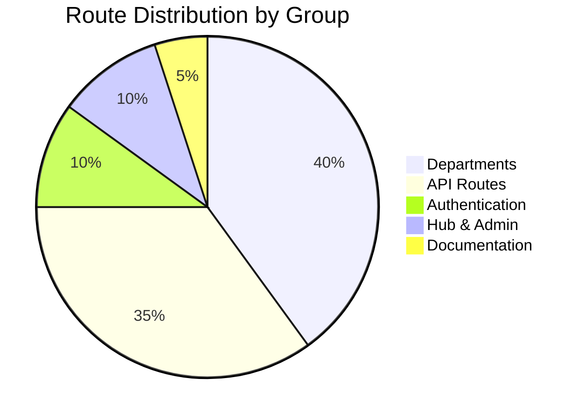
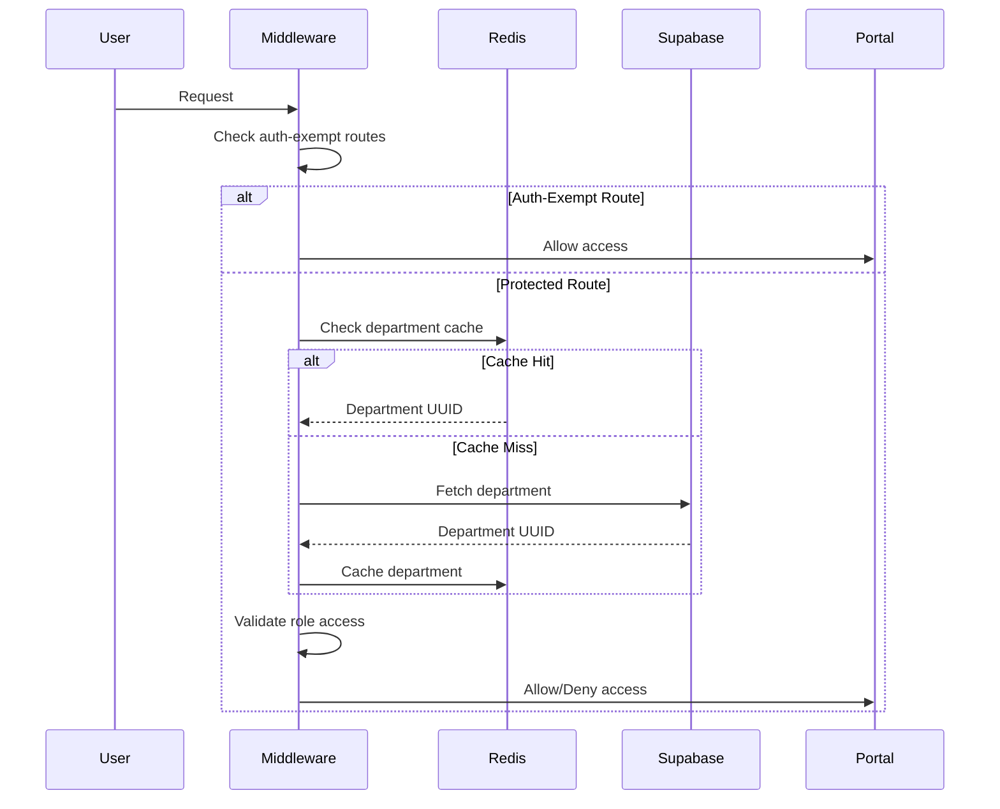
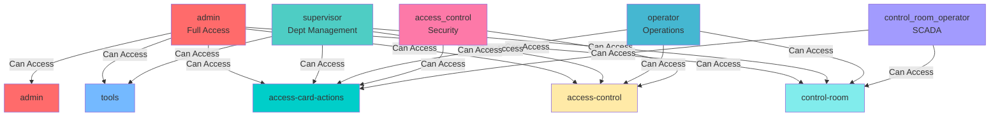
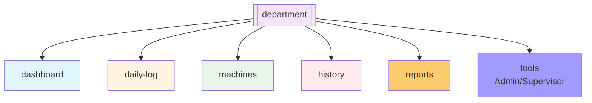
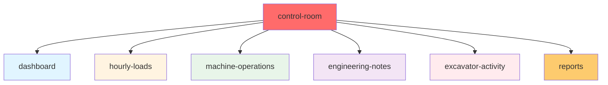
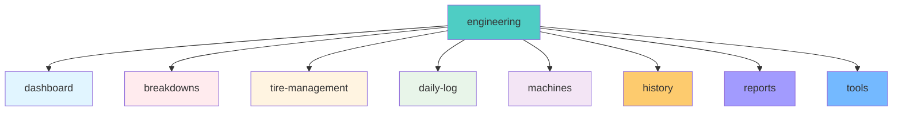
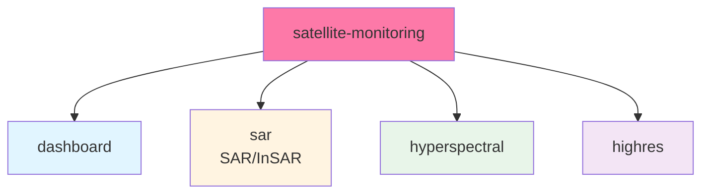
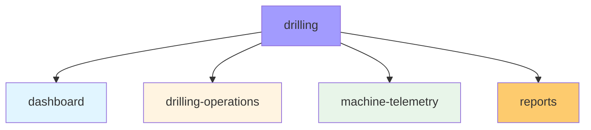

# Route & Feature Architecture Map

**Generated:** 2026-08-18  
**System:** Arch-System Mining Operations Portal

## Overview

This map details the complete route structure, feature organization, and authentication flow for the portal application.

## Visual Overview

### Route Structure Overview

```mermaid
graph TD
    ROOT[/] --> HUB[/hub]
    ROOT --> AUTH[(auth)]
    ROOT --> DEPT[(departments)]
    ROOT --> DOCS[docs]
    ROOT --> ADMIN[/admin]
    ROOT --> OFFLINE[/offline]
    ROOT --> PRIVACY[/privacy]

    AUTH --> LOGIN[/login]
    AUTH --> RESET[/reset-password]
    AUTH --> UPDATE[/update-password]

    DEPT --> DYNAMIC[[department]]
    DEPT --> ACCESS[/access-control]
    DEPT --> CARD[/access-card-actions]
    DEPT --> DRILL[/drilling]
    DEPT --> TRAIN[/training]
    DEPT --> ENG[/engineering]

    DYNAMIC --> DASH[dashboard]
    DYNAMIC --> LOG[daily-log]
    DYNAMIC --> MACH[machines]
    DYNAMIC --> HIST[history]
    DYNAMIC --> REP[reports]
    DYNAMIC --> TOOLS[tools]

    DOCS --> API[/docs/api]

    style ROOT fill:#e1f5ff
    style HUB fill:#fff4e1
    style AUTH fill:#e8f5e9
    style DEPT fill:#f3e5f5
    style DOCS fill:#ffebee
    style ADMIN fill:#fdcb6e
    style OFFLINE fill:#dfe6e9
    style PRIVACY fill:#dfe6e9
```

### Route Distribution by Group



### Authentication Flow



## 1. Authentication & Middleware Flow

### Custom Proxy Middleware

**File:** `apps/portal/server/proxy.ts`

**Auth-Exempt Routes:**

- `/api/c66` - Badge scanner validation (hardware integration)
- `/api/health/*` - Health check endpoints
- `/api/metrics` - Prometheus metrics
- `/reset-password` - Password reset flow
- `/update-password` - Password update flow

**Static File Exemptions:**

- Images, fonts, PWA manifest, robots.txt, sitemap.xml

**Department Isolation:**

- Validates user access to department routes via `DEPARTMENT_ROUTES`
- Department UUID resolution with Redis caching
- Admin bypass for department access

**Role-Based Access Control:**



**Security Features:**

- Server-side redirect validation (allowlist)
- Role normalization (defaults to "operator")
- Login flow optimization (short-circuits Supabase for unauthenticated)

---

## 2. Route Group Structure

### Root Layout

**File:** `apps/portal/app/layout.tsx`

- Global layout with ArchThemeProvider, RouteBackground, MacMenuBar
- PWA manifest, viewport configuration
- Font loading: Inter, JetBrains Mono, Outfit
- Speculation rules for prerendering department routes

### Route Group: `(auth)` - Authentication

**Layout:** `apps/portal/app/(auth)/layout.tsx`

- Purpose: Unauthenticated user flows
- Routes:
  - `/login` - Login page
  - `/reset-password` - Password reset flow
  - `/update-password` - Password update flow

### Route Group: `(departments)` - Department Routes

#### Dynamic Department Layout

**File:** `apps/portal/app/(departments)/[department]/layout.tsx`

- Handles all department routes via dynamic `[department]` parameter
- Validates department exists in DEPARTMENTS constant
- Provides department-specific tabs via `getDepartmentTabs()`

**Standard Department Routes** (drilling, production, engineering, safety, training):



**Control Room Specific Routes** (`/control-room`):



**Engineering Specific Routes** (`/engineering`):



**Satellite Monitoring Specific Routes** (`/satellite-monitoring`):



**Drilling Specific Routes** (`/drilling`):



**Additional Department Pages:**

- `/[department]/breakdowns` - Breakdown tracking
- `/[department]/shift-coverage` - Shift coverage management
- `/[department]/roll-over` - Dozer roll form
- `/[department]/operational-delays` - Operational delays

#### Specialized Department Layouts

**Access Control** (dedicated layout):
**File:** `apps/portal/app/(departments)/access-control/layout.tsx`

```
/access-control
├── /                    - Dashboard
├── /access-logs         - Access logs
├── /badges              - Badge management
├── /visitors            - Visitor management
└── /reports             - Reports
```

**Access Card Actions** (dedicated layout):
**File:** `apps/portal/app/(departments)/access-card-actions/layout.tsx`

```
/access-card-actions
├── /                    - Dashboard
├── /card-actions        - Card actions
├── /print-cards         - Print cards
├── /qr-codes            - QR codes
└── /reports             - Reports
```

**Drilling** (dedicated layout):
**File:** `apps/portal/app/(departments)/drilling/layout.tsx`

```
/drilling
├── /                    - Dashboard
├── /drilling-operations  - Drilling operations
├── /machine-telemetry    - Machine telemetry
└── /reports              - Reports
```

**Training** (dedicated layout):
**File:** `apps/portal/app/(departments)/training/layout.tsx`

```
/training
├── /                    - Overview
├── /certifications      - Certifications
├── /courses             - Courses & LMS
├── /schedules           - Schedules
└── /reports             - Reports
```

**Engineering** (dedicated layout):
**File:** `apps/portal/app/(departments)/engineering/layout.tsx`

```
/engineering
├── /                    - Dashboard
└── /tire-management     - Tire management
```

### Route Group: `hub` - Central Dashboard

**Layout:** `apps/portal/app/hub/layout.tsx`

- Auth-protected layout with mobile bottom navigation
- Fetches accessible departments for user
- Routes:
  - `/hub` - Main hub/dashboard (default redirect from `/`)
  - `/hub/executive` - Executive view

### Route Group: `docs` - Documentation

**Layout:** `apps/portal/app/docs/layout.tsx`

- Role-restricted: admin and engineering roles only
- Routes:
  - `/docs/api` - API documentation

### Top-Level Routes

- `/` - Redirects to `/hub`
- `/admin` - Admin dashboard (admin role only)
- `/offline` - Offline page
- `/privacy` - Privacy policy

---

## 3. API Routes Structure

### Authentication

**File:** `apps/portal/app/api/auth/login/route.ts`

- `POST /api/auth/login` - User authentication
  - Rate limiting: 5 req/15min
  - CSRF protection

### Hardware Integration

**File:** `apps/portal/app/api/c66/route.ts`

- `POST /api/c66` - Badge scanner validation
  - Auth-exempt
  - Requires scanner token

### Health & Monitoring

```
/api/health
├── /                    - Overall health check (DB + Redis)
├── /cache               - Cache health
├── /fuxa                - FUXA SCADA health
├── /live                - Live status
├── /redis               - Redis health
├── /supabase-realtime   - Supabase Realtime health
└── /warmup              - Warmup endpoint
```

### Metrics

**File:** `apps/portal/app/api/metrics/route.ts`

- `GET /api/metrics` - Prometheus metrics (cache, Inngest jobs, DB queries)
- `GET /api/metrics/prometheus` - Prometheus endpoint

### Telemetry

**File:** `apps/portal/app/api/telemetry/push/route.ts`

- `POST /api/telemetry/push` - Push telemetry to FUXA SCADA
  - Two-level caching

### Export Endpoints

```
/api/export
├── /fuel-logs           - Export fuel logs
├── /machines            - Export machine data
├── /production          - Export production data (JSON/CSV)
└── /safety-incidents    - Export safety incidents
```

### Webhooks

**File:** `apps/portal/app/api/webhooks/route.ts`

```
/api/webhooks
├── GET /                - List webhook endpoints
├── POST /               - Create webhook endpoint
├── GET /[id]            - Get specific webhook
├── POST /[id]           - Update webhook
├── DELETE /[id]         - Delete webhook
└── GET /[id]/logs       - Webhook delivery logs
```

### Admin & Data Access

- `GET /api/admin/data/[table]` - Generic admin data access

### Other API Routes

- `POST /api/control-room/shift-completeness` - Shift completeness check
- `POST /api/csp-violations` - CSP violation reporting
- `GET /api/doc` - Documentation
- `POST /api/feedback` - Feedback submission
- `POST /api/inngest` - Inngest webhook handler
- `POST /api/log` - Logging endpoint
- `POST /api/ml/predictive-maintenance` - ML predictive maintenance
- `POST /api/plugins/rust-telemetry` - Rust telemetry plugin
- `GET /api/printers` - List printers
- `GET /api/printers/[id]` - Get printer details
- `POST /api/printers/scan` - Scan for printers
- `POST /api/sync/playback` - Playback sync events
- `GET /api/tools/status` - Tools status
- `GET /api/weather` - Weather data

---

## 4. Department Configuration

**Source:** `libs/features/departments/data-access/src/departments.ts`

### DEPARTMENTS Array (10 departments)

1. **drilling** - Drill rig operations & bit depth telemetry
2. **production** - Coal yield, tonnage & extraction tracking
3. **access-control** - Site access, badging & security
4. **access-card-actions** - Manage printed badges, print cards & QR generation
5. **engineering** - Equipment specs, maintenance & CAD
6. **control-room** - SCADA systems & real-time monitoring
7. **safety** - Incident logs, compliance & inspections
8. **training** - LMS, certifications & competency tracking
9. **satellite-monitoring** - SAR/InSAR, hyperspectral & high-resolution imagery
10. **admin** - Personnel management, shift oversight & quotas

### Tab Configurations

**DEPARTMENT_TABS** (Standard):

- dashboard, daily-log, machines, history, reports, tools

**CONTROL_ROOM_TABS**:

- dashboard, hourly-loads, machine-operations, engineering-notes, excavator-activity, reports

**ENGINEERING_TABS**:

- dashboard, breakdowns, tire-management, daily-log, machines, history, reports, tools

**SATELLITE_MONITORING_TABS**:

- dashboard, sar, hyperspectral, highres

**DRILLING_TABS**:

- dashboard, drilling-operations, machine-telemetry, reports

**ACCESS_CONTROL_TABS**:

- dashboard, access-logs, visitors, badges, reports

**ACCESS_CARD_ACTIONS_TABS**:

- dashboard, card-actions, print-cards, qr-codes, reports

**TRAINING_TABS**:

- dashboard, certifications, courses, schedules, reports

---

## 5. Route Protection Logic

### Middleware Level (server/proxy.ts)

- Department isolation via `DEPARTMENT_ROUTES` check
- Role-based access via `RESTRICTED_ROUTES`
- Admin bypass for department access
- Department UUID resolution with Redis caching

### Layout Level

- **Hub layout:** Fetches accessible departments, redirects unauthorized to login
- **Docs layout:** Role check (admin/engineering only)
- **Admin page:** Role check (admin only) in page component

### Page Level

- Department context validation via `getDepartmentContext()` in `apps/portal/lib/dept-context.ts`
- `requireDepartment()` for department-specific tabs

---

## 6. Key Utility Functions

**File:** `apps/portal/lib/dept-context.ts`

- `getDepartmentContext()` - Resolves department context with Redis caching
- `requireDepartment()` - Validates department access for specific tabs

**File:** `apps/portal/lib/tools.ts`

- `getTools()` - Fetches productivity tools from database
- `EXTERNAL_TOOLS` - External tool configurations (n8n, Flowise)

---

## 7. Role Hierarchy & Permissions

```
admin (highest)
├── Full system access
├── All departments
├── Admin tools
└── Can manage users

supervisor
├── Department management
├── Tools access
├── Reports access
└── Shift oversight

operator
├── Department operations
├── Data entry
├── Reports (view only)
└── Limited tools

access_control
├── Access control system
├── Badge management
├── Visitor management
└── Access logs

control_room_operator
├── Control room operations
├── SCADA monitoring
├── Machine operations
└── Load tracking
```

---

## 8. Feature Organization by Domain

### Access Control

- Personnel management
- Badge printing and QR generation
- Visitor tracking
- Access logs and gate monitoring
- Role-based access control

### Operations

- Machine operations tracking
- Hourly load monitoring
- Excavator activity
- Dozer roll tracking
- Shift management

### Engineering

- Equipment breakdowns
- Tire management
- Maintenance scheduling
- Engineering notes
- CAD integration

### Drilling

- Drill operations logging
- Machine telemetry
- Bit depth tracking
- Production delays
- Performance metrics

### Safety

- Incident reporting
- Compliance tracking
- Safety inspections
- Risk assessment
- Training records

### Training

- LMS integration
- Certification tracking
- Course management
- Competency assessment
- Schedule management

### Satellite Monitoring

- SAR/InSAR imagery
- Hyperspectral data analysis
- High-resolution imagery
- Remote sensing
- Change detection

### Analytics & Reporting

- Production reports
- Safety reports
- Equipment utilization
- Shift completeness
- Executive dashboards

---

## Summary

The portal uses a sophisticated route architecture with:

- **10 departments** with specialized tab configurations
- **Dynamic routing** via `[department]` parameter for standard departments
- **Dedicated layouts** for specialized departments (access-control, drilling, training, engineering)
- **Middleware authentication** with department isolation and role-based access
- **34+ API endpoints** covering auth, telemetry, exports, webhooks, health checks
- **Route groups** for logical separation: `(auth)`, `(departments)`, `hub`, `docs`
- **Role-based protection** at middleware, layout, and page levels
- **Redis caching** for department UUID lookups and employee data
- **Auth-exempt routes** for hardware integration and health monitoring
