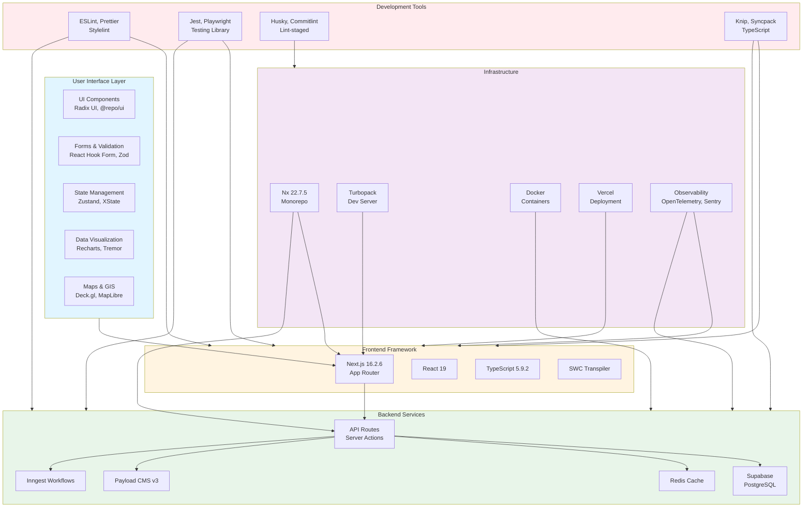
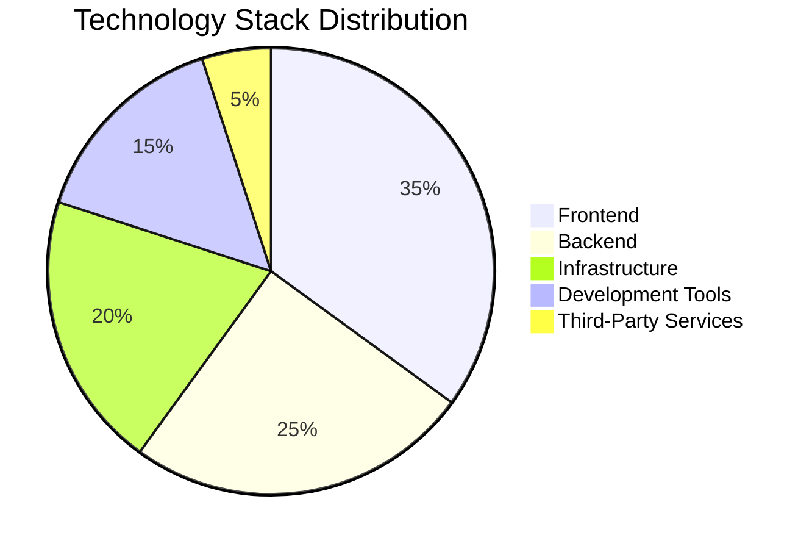
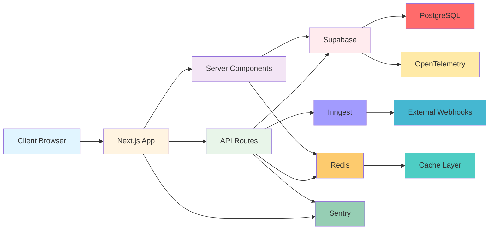
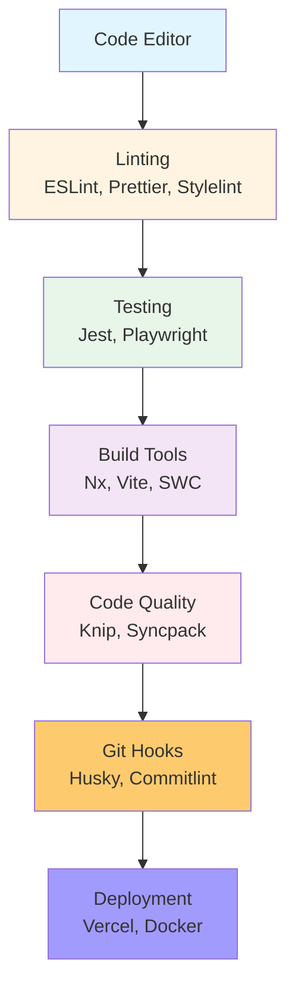

# Technology Stack Map

**Generated:** 2026-08-18  
**System:** Arch-System Mining Operations Portal

## Overview

This map details the complete technology stack across the entire system, including frontend, backend, infrastructure, development tools, and third-party services.

## Visual Overview

### Technology Stack Layers



### Technology Stack Distribution



### Architecture Overview



---

## 1. Core Platform

### Runtime Environment

- **Node.js:** >=22 (Volta: 24.15.0)
- **Package Manager:** pnpm 9.15.9
- **Type:** ESM (type: module)
- **OS:** Linux 7.1.8-zen1-3-zen

### Monorepo Management

- **Nx:** 22.7.5
- **Workspace:** pnpm workspaces
- **Build System:** Nx run-many, Turbopack (dev), SWC (production)
- **Caching:** Nx Cloud distributed caching

---

## 2. Frontend Stack

### Framework & Core

- **Next.js:** 16.2.6 (App Router)
- **React:** 19 (catalog:react19)
- **TypeScript:** 5.9.2
- **SWC:** 1.15.40 (transpilation)

### Styling & Design System

- **Tailwind CSS:** catalog version
- **Custom Design Tokens:** OKLCH color space
- **CSS Variables:** --arch0–--arch15
- **Glass Morphism:** backdrop-blur, border opacity
- **Named Shadows:** shadow-card, shadow-window, shadow-diffusion-\*
- **Animation:** opacity, transform, background-color, border-color, color
- **Easing:** cubic-bezier(0.16, 1, 0.3, 1)

### UI Components

- **Radix UI:** @radix-ui/react-popover
- **Custom Component Library:** @repo/ui
- **Icons:** lucide-react (scoped imports only)
- **Forms:** react-hook-form, @hookform/resolvers
- **Validation:** zod
- **Toast:** sonner
- **State Management:** zustand, xstate

### Data Visualization

- **Charts:** recharts, @tremor/react
- **Maps:**
  - @deck.gl/layers, @deck.gl/react
  - maplibre-gl
  - react-map-gl
- **Spreadsheets:** @univerjs/presets, @univerjs/preset-sheets-core

### Specialized Libraries

- **PDF Generation:** @react-pdf/renderer
- **QR Codes:** qr-code-styling
- **Smooth Scrolling:** lenis
- **PWA:** @ducanh2912/next-pwa

### AI & ML

- **AI SDK:** @ai-sdk/react (v1.2.0)
- **ML Endpoint:** /api/ml/predictive-maintenance

---

## 3. Backend Stack

### Framework & Runtime

- **Next.js:** 16.2.6 (API Routes, Server Actions, Server Components)
- **Node.js:** 22+
- **TypeScript:** 5.9.2

### Database

- **Database:** PostgreSQL
- **ORM/Client:** Supabase client
- **Migrations:** Supabase CLI
- **RLS:** Row-Level Security enabled on all tables
- **Extensions:** pgvector (vector search), pg_cron (scheduled jobs)

### Caching

- **Redis:** Rate limiting, department slug cache, session storage
- **Two-Level Caching:** Redis + in-memory for telemetry

### CMS

- **Payload CMS:** v3.84.1
- **Payload DB:** @payloadcms/db-postgres
- **Payload Next:** @payloadcms/next
- **Rich Text:** @payloadcms/richtext-lexical

### Workflow Automation

- **Inngest:** v4.4.0
- **Webhook Handler:** /api/inngest

### Authentication

- **Supabase Auth:** JWT-based authentication
- **Custom Implementation:** Employee table as source of truth
- **Middleware:** Custom proxy middleware (server/proxy.ts)
- **Roles:** admin, supervisor, operator, access_control, control_room_operator

---

## 4. Infrastructure & DevOps

### Containerization

- **Docker:** Container runtime
- **Docker Compose:** Local development and staging
- **Docker Hub:** Container registry for production

### Deployment

- **Vercel:** Primary deployment platform
- **SSH/On-Premises:** Alternative deployment
- **Docker Deployment:** Container-based deployment
- **Canary:** Gradual rollout support (10% → 100%)

### Monitoring & Observability

- **OpenTelemetry:** @opentelemetry/sdk-node, @opentelemetry/auto-instrumentations-node
- **Sentry:** @sentry/nextjs, @sentry/react
- **Prometheus:** prom-client metrics
- **Health Checks:** /api/health/\* endpoints
- **SLO Monitoring:** slo_metrics table

### Logging

- **Custom Logger:** @repo/logger
- **Audit Logs:** audit_logs table
- **Cache Events:** cache_events table

### Security

- **Secret Scanning:** gitleaks, secretlint
- **Dependency Auditing:** npm audit
- **Container Security:** Trivy
- **SAST:** CodeQL
- **DAST:** OWASP ZAP
- **Rate Limiting:** @repo/rate-limiter
- **CSRF Protection:** API route protection

---

## 5. Development Tools

### Development Toolchain



### Build Tools

- **Nx:** 22.7.5 (monorepo orchestration)
- **Vite:** 8.0.16 (build tool)
- **SWC:** 1.15.40 (transpiler)
- **Turbopack:** Next.js dev server
- **Next.js Bundle Analyzer:** @next/bundle-analyzer

### Testing

- **Unit Testing:** Jest 30.0.0
- **E2E Testing:** Playwright 1.60.0
- **Testing Library:** @testing-library/react, @testing-library/jest-dom
- **Accessibility Testing:** axe-playwright
- **Visual Regression:** Playwright visual tests

### Linting & Formatting

- **ESLint:** catalog version
- **Prettier:** catalog version
- **Stylelint:** 17.11.1
- **Markdown Lint:** markdownlint-cli
- **Spell Check:** cspell
- **TypeScript Lint:** @typescript-eslint/parser

### Code Quality

- **Dead Code Detection:** knip 5.45.0
- **Dependency Consistency:** syncpack 13.0.4
- **Bundle Size:** bundlesize
- **Policy Checking:** Custom policy compiler

### Git Hooks

- **Husky:** 9.1.7
- **Commitlint:** 21.0.1
- **Lint-staged:** 17.0.7
- **Conventional Commits:** commitlint.config-conventional

### Documentation

- **API Documentation:** Swagger/OpenAPI (next-swagger-doc, swagger-ui-react)
- **Storybook:** 8.6.14
- **Markdown:** docs/ directory

---

## 6. Third-Party Integrations

### Integration Architecture

```mermaid
graph TD
    PORTAL[Portal App] --> SCADA[FUXA SCADA]
    PORTAL --> HARDWARE[C66 Scanner]
    PORTAL --> N8N[n8n Workflows]
    PORTAL --> FLOWISE[Flowise AI]
    PORTAL --> WEATHER[Weather API]
    PORTAL --> WEBHOOKS[Webhooks]

    SCADA --> TELEMETRY[/api/telemetry/push]
    HARDWARE --> C66[/api/c66]

    WEBHOOKS --> SVIX[Svix Service]
    WEBHOOKS --> CUSTOM[Custom Webhooks]

    style PORTAL fill:#e1f5ff
    style SCADA fill:#fff4e1
    style HARDWARE fill:#e8f5e9
    style N8N fill:#f3e5f5
    style FLOWISE fill:#ffebee
    style WEATHER fill:#fdcb6e
    style WEBHOOKS fill:#a29bfe
    style TELEMETRY fill:#4ecdc4
    style C66 fill:#45b7d1
    style SVIX fill:#96ceb4
    style CUSTOM fill:#ffeaa7
```

### SCADA Integration

- **FUXA:** SCADA system integration
- **Telemetry Push:** /api/telemetry/push
- **Health Check:** /api/health/fuxa

### Hardware Integration

- **Badge Scanner:** C66 scanner integration
- **API Endpoint:** /api/c66 (auth-exempt)
- **Card Printing:** CUPS integration

### External Tools

- **n8n:** Workflow automation
- **Flowise:** AI workflows
- **Weather Data:** /api/weather

### Webhooks

- **Svix:** Webhook delivery service
- **Custom Webhooks:** webhook_endpoints table
- **Delivery Logs:** webhook_delivery_logs table

---

## 7. Data & Analytics

### Vector Search

- **pgvector:** PostgreSQL extension for vector similarity
- **HNSW Index:** High-performance vector search
- **Embedding Cache:** embedding_cache table
- **Memory Types:** Episodic, semantic

### Analytics

- **Production Tracking:** production_logs table
- **Machine Utilization:** machine_operations table
- **Load Tracking:** hourly_loads table
- **Drill Telemetry:** machine_telemetry table

### Reporting

- **Report Templates:** report_templates table
- **Generated Reports:** generated_reports table
- **Export Endpoints:** /api/export/\* (JSON/CSV)

---

## 8. Performance Optimization

### Caching Strategy

- **Redis:** Department slug cache, session storage
- **Nx Cache:** Distributed build caching
- **Embedding Cache:** Vector embedding results
- **Two-Level Cache:** Telemetry data (Redis + in-memory)

### Database Optimization

- **Partitioning:** Monthly partitions for time-series data
- **Indexing:** Composite indexes, foreign key indexes
- **Materialized Views:** Production summaries, utilization data
- **Archive Tables:** Historical data archival

### Build Optimization

- **Turbopack:** Fast dev server
- **SWC:** Fast transpilation
- **Nx Affected:** Only build changed packages
- **Code Splitting:** Next.js automatic code splitting

---

## 9. Security Architecture

### Authentication & Authorization

- **Supabase Auth:** JWT-based authentication
- **RLS Policies:** Row-level security on all tables
- **Role-Based Access:** admin, supervisor, operator, access_control, control_room_operator
- **Department Isolation:** Department-scoped data access
- **Cross-Department Access:** accessible_departments array

### Data Protection

- **Encryption:** Supabase encryption at rest
- **Secret Management:** Environment variables, secrets_rotation_log
- **Soft Delete:** deleted_at pattern for sensitive data
- **Audit Trail:** audit_logs table for all mutations

### Network Security

- **CSP:** Content Security Policy
- **Rate Limiting:** @repo/rate-limiter
- **CSRF Protection:** API route protection
- **Auth-Exempt Routes:** Hardware integration endpoints

---

## 10. Development Workflow

### Local Development

- **Dev Server:** `pnpm dev` (Turbopack)
- **Database:** `pnpm --filter @repo/database supabase:dev` (Docker)
- **Quick Start:** `pnpm dev:quick` (skip Docker/Supabase)
- **Hosted Supabase:** `pnpm dev:hosted`
- **Full Stack:** `pnpm dev:up --all`

### Quality Gates

- **Pre-Commit:** Husky hooks, lint-staged
- **Pre-Push:** `pnpm quality` (comprehensive checks)
- **CI:** Multi-stage pipeline with all quality checks
- **Pre-Deployment:** Full quality gate

### Deployment Workflow

- **Staging:** Automatic on push to main/master
- **Production:** Manual trigger or tag-based (v\*)
- **Canary:** Manual workflow_dispatch
- **Rollback:** Built-in rollback capability

---

## 11. Configuration Management

### Environment Variables

- **Supabase:** SUPABASE_URL, SUPABASE_ANON_KEY, SUPABASE_SERVICE_KEY
- **Redis:** REDIS_URL
- **Sentry:** SENTRY_DSN, NEXT_PUBLIC_SENTRY_DSN
- **External Services:** N8N_URL, FLOWISE_URL, NEXT_PUBLIC_FUXA_URL
- **Deployment:** VERCEL_TOKEN, DEPLOY_HOST, DOCKER_USERNAME

### Feature Flags

- **Feature Flags Table:** feature_flags
- **A/B Testing:** ab_test_results table
- **Rollout Percentage:** Configurable per flag
- **Target Groups:** User and group targeting

---

## 12. Monitoring & Alerting

### Health Monitoring

- **Health Endpoints:** /api/health/\* (DB, Redis, FUXA, Realtime)
- **Live Status:** /api/health/live
- **Warmup:** /api/health/warmup

### Metrics

- **Prometheus:** /api/metrics/prometheus
- **Custom Metrics:** Cache, Inngest jobs, DB queries
- **SLO Metrics:** slo_metrics table

### Alerting

- **Shift Completeness:** shift_completeness_alerts table
- **Data Integrity:** data_integrity_issues table
- **Cache Anomalies:** cache_anomalies table

---

## Summary

The technology stack features:

- **Modern Frontend:** Next.js 16, React 19, TypeScript, Tailwind CSS
- **Robust Backend:** Next.js API routes, Server Actions, PostgreSQL, Supabase
- **Advanced Caching:** Redis, two-level caching, Nx distributed caching
- **Comprehensive Testing:** Jest, Playwright, Testing Library, accessibility tests
- **Security-First:** RLS policies, secret scanning, dependency auditing, container security
- **Performance Optimized:** Turbopack, SWC, partitioning, materialized views, HNSW indexes
- **Observability:** OpenTelemetry, Sentry, Prometheus, comprehensive logging
- **Flexible Deployment:** Vercel, SSH, Docker, canary deployments
- **Integration-Ready:** SCADA, hardware, webhooks, external tools
- **Developer Experience:** Nx monorepo, Turbopack, comprehensive tooling
