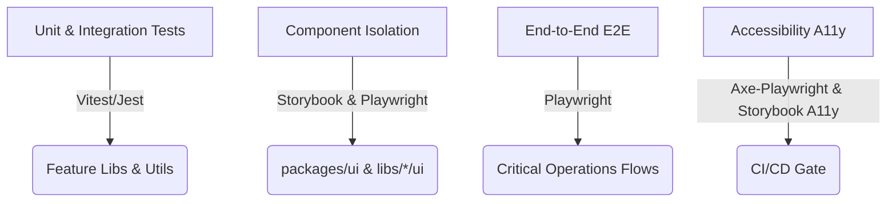

# Continuous Improvement & Operational Excellence Strategy

This document outlines the strategic roadmap and action plans for the long-term health, efficiency, and robustness of the Arch-System industrial operations portal.

---

## 4. Comprehensive Testing Strategy

### Objective

Ensure code quality, prevent regressions, and improve developer confidence through a multi-layered testing strategy spanning unit, component, integration, accessibility, and end-to-end tests.



### Current Status

- **Unit/Integration Tests**: Run via `pnpm nx run-many -t test`. Test suites exist for packages and applications.
- **Component Testing**: Storybook is integrated into `@repo/ui`.
- **E2E Testing**: Active Playwright E2E suite under [e2e/](file:///home/timoty/Desktop/project/Arch-System/e2e).
- **Accessibility**: [e2e/accessibility.spec.ts](file:///home/timoty/Desktop/project/Arch-System/e2e/accessibility.spec.ts) is configured for landing and general paths. Automated Storybook A11y tests run in CI/CD via `test:a11y`.

### Action Plan & Recommendations

#### 1. Unit & Integration Tests Coverage Expansion

- **Policy**: Enforce 80%+ test coverage for all new feature libraries (`libs/features/*`), especially targeting data-access and utility layers.
- **Implementation**:
  - Set up Jest or Vitest coverage thresholds inside `jest.config.ts` or `vite.config.ts` for each library:
    ```json
    "coverageThreshold": {
      "global": {
        "branches": 80,
        "functions": 80,
        "lines": 80,
        "statements": 80
      }
    }
    ```
  - Focus tests on Supabase Client wrapper logic, server actions validations, and business logic mapping.

#### 2. Isolated Component Testing with Storybook

- **Policy**: Every component in `packages/ui` must have a corresponding `.stories.tsx` file.
- **Implementation**:
  - Use `@storybook/addon-interactions` and `@storybook/test` for simulating user flows (e.g., button clicks, form fills) inside Storybook itself.
  - Integrate `@storybook/testing-react` or modern equivalents to render and test stories within standard unit tests.

#### 3. E2E Operational Flow Coverage

- **Policy**: Expand [e2e/](file:///home/timoty/Desktop/project/Arch-System/e2e) tests to verify critical multi-step operator workflows.
- **Flows to cover**:
  - **Shift Handover**: Login $\rightarrow$ review open incidents $\rightarrow$ write notes $\rightarrow$ execute closeout $\rightarrow$ verify downstream dashboard update.
  - **Telemetry Alarm Ack**: View live drill data $\rightarrow$ trigger warning $\rightarrow$ acknowledge warning $\rightarrow$ verify 2-second "undo" snackbar behavior.
  - **Access Card Print**: Search employee $\rightarrow$ click print card $\rightarrow$ mock CUPS response $\rightarrow$ verify print queue job created.

#### 4. Automated A11y Verification

- **Policy**: All key pages must pass Axe-Core validation checks under E2E testing.
- **Implementation**:
  - Expand the existing `accessibility.spec.ts` using `axe-playwright`:

    ```typescript
    import { test, expect } from "@playwright/test";
    import { injectAxe, checkA11y } from "axe-playwright";

    test("should pass accessibility audits", async ({ page }) => {
      await page.goto("/access-card-actions/card-actions");
      await injectAxe(page);
      await checkA11y(page, undefined, {
        detailedReport: true,
        detailedReportOptions: { html: true },
      });
    });
    ```

---

## 5. Performance Monitoring & Optimization

### Objective

Maintain fast load times, smooth interactions, and efficient resource usage in demanding control-room environments.

### Current Status

- **Web Vitals**: A custom `WebVitalsReporter` in `apps/portal` tracks operational parameters.
- **Bundle Analyzer**: Configured via `@next/bundle-analyzer` and executed through `pnpm analyze`.
- **Asset Synchronization**: Smart asset synchronization is handled using `scripts/sync-assets-smart.cjs`.

### Action Plan & Recommendations

```
[Optimization Cycle]
   ├── Bundle Analysis (pnpm analyze) ──> Tree Shaking / Code Splitting
   ├── Asset Optimization (WebP/AVIF) ──> CDN & caching-strategy.md
   └── Cascade Layering (CSS layers)  ──> Reduce Hydration mismatches
```

#### 1. Real-Time Web Vitals Logging

- Integrate `WebVitalsReporter` metrics into the centralized OpenTelemetry telemetry exporter (using `BatchSpanProcessor` under `monitoring/`).
- Establish alerts for Core Web Vitals degradation:
  - **Largest Contentful Paint (LCP)**: Target $\le$ 2.5s.
  - **Interaction to Next Paint (INP)**: Target $\le$ 200ms.
  - **Cumulative Layout Shift (CLS)**: Target $\le$ 0.1.

#### 2. Bundle Optimization and Tree-Shaking

- Review the output of `pnpm analyze` to isolate heavy packages.
- Optimize Tailwind and Radix primitives by avoiding dynamic imports where static ones suffice, and ensure all component imports are fully tree-shakeable.
- Enforce Webpack performance budgets in `next.config.mjs` to error on bundle compilation when exceeding limits (e.g. maxAssetSize: 500 KB).

#### 3. Image & Asset Optimization

- Enforce standard usage of `next/image` rather than raw HTML `` elements for all portal UI features to leverage automatic resizing, WebP/AVIF conversion, and lazy loading.
- Host large layout assets or video guides on optimized edge CDN storage buckets with caching headers defined in `docs/operations/caching-strategy.md`.

#### 4. Critical CSS and Hydration Safety

- Leverage CSS Cascade Layers (`@layer reset`, `@layer components`, `@layer utilities`) to prevent flash of unstyled content (FOUC).
- Minimize dynamic state rendering differences between server-side generation (SSG/SSR) and client hydration by utilizing Next.js `dynamic(() => ..., { ssr: false })` only where browser-only variables (e.g., local storage drafts, screen resolutions) are required.

---

## 6. Enhanced Documentation & Developer Experience (DX)

### Objective

Foster easier onboarding, consistent development patterns, and a robust documentation cycle across the distributed monorepo.

### Current Status

- **Workspace Guides**: [docs/DOCUMENTATION_INDEX.md](file:///home/timoty/Desktop/project/Arch-System/docs/DOCUMENTATION_INDEX.md) and [CLAUDE.md](file:///home/timoty/Desktop/project/Arch-System/CLAUDE.md) are available as quick-reference indexes.
- **Rules**: Detailed rules are isolated under [.claude/rules/](file:///home/timoty/Desktop/project/Arch-System/.claude/rules).
- **Code Scaffolding**: Nx generators are configured to speed up creation.

### Action Plan & Recommendations

#### 1. Interactive Component Documentation (Storybook)

- Maintain fully documented Storybook knobs and variants for UI components.
- Build automated story generation into standard library scaffolding templates.

#### 2. Feature Runbooks & Domain Mapping

- Maintain a standard `RUNBOOK.md` inside each feature package folder (`packages/features/*` or `libs/features/*`).
- Every runbook must include:
  1. **Domain Context**: What business rule or mining/control-room system it maps to.
  2. **Data Model**: What Supabase schema tables or local variables are updated.
  3. **Operational Failure Modes**: What happens when the network, Supabase database, or physical equipment disconnects, and how to recover.

#### 3. Architectural Decision Records (ADRs)

- Maintain the ADR log under `docs/adr/`.
- Follow a standardized template:

  ```markdown
  # ADR [Number]: [Short Title]

  ## Context

  [What is the problem we are solving, and what options did we evaluate?]

  ## Decision

  [What option did we choose, and why?]

  ## Consequences

  [What is the impact on security, performance, database migrations, and testing?]
  ```

#### 4. Custom Nx Scaffolding Generators

- Utilize the `feature-scaffolder` skill logic to generate custom generator schemas.
- Run standard Nx generator paths for library creation, then apply custom tags:
  ```bash
  pnpm nx g @nx/react:library libs/features/my-new-feature --directory=libs/features
  node tools/apply-project-tags.cjs
  ```

---

## 7. Continuous Integration & Deployment (CI/CD) Automation

### Objective

Minimize CI build times, maximize build cache efficiency, and automate target deployments with high safety margins.

### Current Status

- **CI Tooling**: Parallel CI jobs defined in [.github/workflows/ci.yml](file:///home/timoty/Desktop/project/Arch-System/.github/workflows/ci.yml).
- **Caching**: Nx remote caching integrated using MinIO.
- **Linting gates**: Lint-staged, prettier, eslint, stylelint, and syncpack are integrated into git pre-commit hooks.

### Action Plan & Recommendations

```
[GitHub Actions Trigger]
    ├── pnpm install (with cached node_modules)
    ├── nx affected -t lint type-check test
    ├── nx affected -t build (remote caching via MinIO)
    └── Playwright / Lighthouse CI runs on affected targets
```

#### 1. Optimizing Nx Affected Runs

- Standardize the use of target dependencies in `nx.json` to ensure dependent builds are resolved in correct order.
- Ensure all developers commit their changes to distinct feature branches so that `nx affected` commands can accurately calculate SHAs using:
  ```bash
  pnpm nx affected -t lint type-check test build
  ```

#### 2. Maximize Build Cache Utility

- Continuously audit build cache hit rates on the MinIO bucket.
- Configure `namedInputs` inside `nx.json` to ignore unimportant files (such as local `.md` modifications, local test output files) from triggering cache invalidation.

#### 3. Streamlined Automated Deployments

- Connect the automated deployment script [scripts/deploy.sh](file:///home/timoty/Desktop/project/Arch-System/scripts/deploy.sh) to staging/production CD environments.
- Use blue-green deployments for zero-downtime portal upgrades.
- Integrate database health probes (`/api/health`) directly into staging smoke test gates before routing live DNS traffic.
