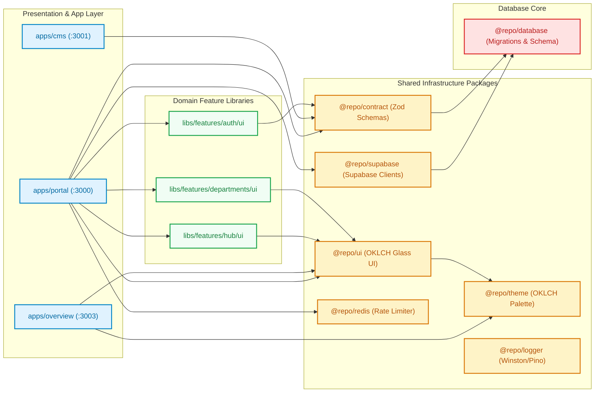

# 🕸️ Monorepo Dependencies & Topology Graph Map

**Generated:** 8/20/2026, 9:17:54 AM UTC  
**Architecture:** Nx 22 Monorepo Topology

---

## 📊 Visual Monorepo Architecture Graph

---

## 🚫 ESLint Module Boundary Enforcement Matrix

| Source Tag | Allowed Dependencies | Forbidden Dependencies |
| :--- | :--- | :--- |
| `scope:app` | `scope:package`, `scope:feature` | `scope:package:db-internal` |
| `scope:package:ui` | `scope:package:theme` | `scope:package:db`, `scope:package:db-internal`, `scope:package:supabase` |
| `scope:package:theme` | Primitive tokens | `scope:package:ui` |
| `scope:tool` | Local Node scripts | `scope:app`, `scope:package:supabase` |
