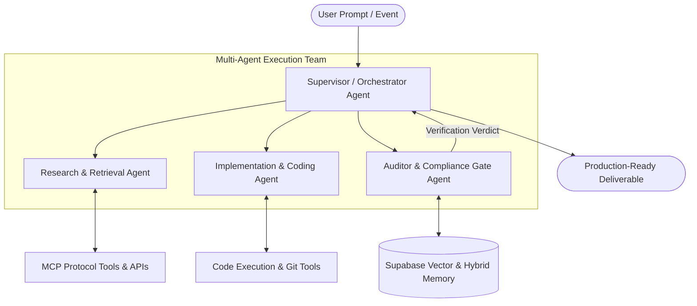

# Agentic AI Architecture & Multi-Agent Design Patterns

<!-- AGENT-TRACE: Autonomous agent orchestration patterns, MCP tool protocols, and hybrid memory architectures synthesized from modern agentic design practices (panaversity/learn-agentic-ai). -->

## 1. Core Agentic Design Patterns

### Key Cognitive Patterns:
1. **Reflection & Self-Correction**: Agents evaluate their own tool outputs, verify schema validity, and iteratively fix syntax or test failures before concluding.
2. **Tool Use & Model Context Protocol (MCP)**: Strict JSON schema tool encapsulation ensuring stateless, deterministic execution across external services.
3. **Planning & Task Decomposition**: Bounded step-by-step breakdown (e.g. `/plan`, `/goal`) resolving dependencies sequentially.
4. **Multi-Agent Orchestration**: Specialization of subagents (Research, Review, Engineering) with explicit handover context and zero polling.

---

## 2. Memory Tiering Architecture

| Memory Tier | Storage Backend | Latency | Purpose |
|---|---|---|---|
| **Short-Term Context** | Prompt Prefix Cache / Local Memory | $< 1\text{ ms}$ | Turn-by-turn conversational continuity and fast reasoning. |
| **Episodic & Task State** | Redis Key-Value (`arch:auth:*`, `telemetry:*`) | $< 5\text{ ms}$ | Real-time session state, active telemetry buffers, and rate limits. |
| **Long-Term Semantic Memory** | Supabase Cloud PostgreSQL (`pgvector` + HNSW) | $< 50\text{ ms}$ | Hybrid full-text + vector search across architectural verdicts and cross-session learnings. |

---

## 3. Deployment & Bootstrap Integration

To ensure zero-configuration startup, all core infrastructure (Redis, Supabase client, and Agentic MCP gateways) are auto-bootstrapped on every deployment run via `scripts/dev.sh` and `scripts/setup-production-environment.sh`.
